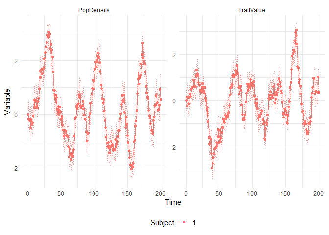
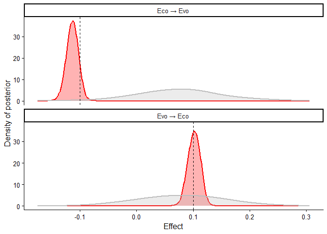

# Example for Figure 2. Reverse causation in simple regression models
Sam Walmsley, Suchinta Arif, Hal Whitehead

This example demonstrates how a model specified with ordinary
differential equations can be used to infer bidirectional effects from
simulated data.

We begin by loading in key packages.

``` r
library(ggplot2)
library(ctsem)
library(data.table)
library(tidyr)
library(brms)
```

Here we specify the parameters defining our eco-evolutionary system. Our
aim is for the model we fit to recover these “true” values. In
particular, we are interested in the “Eco_to_Evo” and “Evo_to_Eco”
effects, which capture the bidirectionality in the system. We begin by
setting up the number of time points and observations that we want to
include.

``` r
# Set up time points
times <- seq(from=0, to=200, by=1)
Nobs <- length(times)

# System parameters for perfect oscillations
A_pop <- -0.01         # Modest self-regulation for population 
A_trait <- -0.01      # Modest self-regulation for trait
  
# Exactly balanced cross-effect parameters
Eco_to_Evo <- -0.1    # Effect of population on trait
Evo_to_Eco <- 0.1   # Effect of trait on population (negative feedback)
  
# Equal continuous intercepts
B_pop <- 0
B_trait <- 0

# System noise
G_pop <- 0.2
G_trait <- 0.2
G_cross <- 0.2
```

Here we iteratively generate the data based on our parameters, encoding
key features such as autoregressive effects, bidirectional effects, and
measurement error.

``` r
# Create data frame
data <- data.frame(
  Time = times,
  PopDensity = rep(NA, Nobs),
  TraitValue = rep(NA, Nobs)
)

# Specify initial values
initialPopDensity <- 0
initialTraitValue <- 0 

# Initialize states
PopDensityState <- initialPopDensity
TraitValueState <- initialTraitValue

# Generate data with eco-evolutionary feedback
for(obsi in 1:Nobs) {
  
  # if first observation, just use initial values
  if(obsi == 1) {
    data$PopDensity[obsi] <- PopDensityState
    data$TraitValue[obsi] <- TraitValueState
    
  } else {
    
    # Calculate deterministic changes:
    dPopDensity <- A_pop * PopDensityState + Evo_to_Eco * TraitValueState + B_pop
    dTraitValue <- A_trait * TraitValueState + Eco_to_Evo * PopDensityState + B_trait
      
    # Generate system noise
    systemNoisePopDensity <- rnorm(n=1, mean=0, sd=1)
    systemNoiseTraitValue <- rnorm(n=1, mean=0, sd=1)
    systemNoiseCross <- rnorm(n=1, mean=0, sd=1)
    
    # Update states
    PopDensityState <- PopDensityState + dPopDensity + 
    G_pop * systemNoisePopDensity + G_cross * systemNoiseCross
    
    TraitValueState <- TraitValueState + dTraitValue + 
    G_trait * systemNoiseTraitValue + G_cross * systemNoiseCross
    }
  
  data$PopDensity[obsi] <- PopDensityState
  data$TraitValue[obsi] <- TraitValueState
  
}

# Add minimal measurement error
data$PopDensity <- data$PopDensity + rnorm(n=Nobs, mean=0, sd=0.01)
data$TraitValue <- data$TraitValue + rnorm(n=Nobs, mean=0, sd=0.01)

# Add ID variable for ctsem format
data$ID <- 1
```

Now we specify the model as follows.

``` r
# Specify continuous time model for eco-evolutionary feedback
ct_model <- ctModel(
  # Variable naming
  manifestNames = c("PopDensity", "TraitValue"),  # Observed variables
  latentNames = c("PopDensity", "TraitValue"),    # Latent processes 
  
  # Data structure parameters
  time = "Time",                            # Time column name
  id = "ID",                                # ID column name
  type = "ct",                          # Continuous time model
  
  # Measurement model parameters
  LAMBDA = diag(1, 2),                      # Identity mapping 
  MANIFESTMEANS = 0,                        # No measurement intercept
  MANIFESTVAR = c(
    "measError_Pop", 0,                     # Measurement error for population
    0, "measError_Trait"                    # Measurement error for trait
  ),
  
  # Dynamics matrix - key eco-evolutionary parameters
  DRIFT = c(
    "A_pop", "Evo_to_Eco",                  # Population dynamics row
    "Eco_to_Evo", "A_trait"                 # Trait dynamics row
  ),
  
  # Continuous intercepts (baseline rates)
  CINT = c("B_pop", "B_trait"),                  
  
  # Initial state parameters
  T0MEANS = c("init_PopDensity", "init_TraitValue"),
  
  # System noise parameters (stochastic components)
  DIFFUSION = c(
    "G_pop", 0,                             # Pop noise and upper triangle 0
    "G_cross", "G_trait"))                  # Correlation & trait noise
```

Now that the model has been specified, we can fit it to our
observational data:

``` r
# Fit the model to data
ct_fit <- ctStanFit(datalong = data, ctstanmodel = ct_model, 
                    optimize=FALSE, priors=TRUE)
# Note setting optimization to FALSE for full HMC sampling
# Optimization method faster but less reliable
# (https://www.rdocumentation.org/packages/ctsem/versions/3.10.4/topics/ctStanFit)
```

Finally, we can assess and visualize the results to see if we recovered
the “true” simulated values. Given our interest in bidirectional
effects, we are primarily concerned with the cross effects “Evo_to_Eco”
and “Eco_to_Evo”. We can also use the ctKalman function below to create
a plot of model expectations relative to the observed data. Here the
plots show “subject 1”, which simply reflects the fact that our
simulation included a single unit of analysis: more specifically, a
single population. See Figure 4 in the main text for an alternate
visualization of the same simulation and fitted model.

``` r
# Summarize results
# summary(ct_fit, parmatrices = FALSE)
ctKalman(ct_fit, plot=TRUE)
```



``` r
## Extract posteriors for ctsem model.
post <- ctExtract(ct_fit)
drift_samples <- post$pop_DRIFT   # posterior samples: draws × 2 × 2

ct_Eco_to_Evo <- drift_samples[, 2, 1]  # Pop → Trait
ct_Evo_to_Eco <- drift_samples[, 1, 2]  # Trait → Pop
```

Next, we will fit two simple regression models to compare how their
outputs compare to the estimates from the continuous time model, which
aims to specifically address the potentially bidirectional change in
traits over time. These are simply the regressions of one variable on
the other, using each datapoint in the time series.

``` r
# Weakly informative priors
reg_prior <- prior(normal(0, 1), class = "b") +
             prior(exponential(1), class = "sigma")

# Trait ~ Pop
m_trait_on_pop <- brm(
  TraitValue ~ PopDensity,
  data   = data,
  family = gaussian(),
  prior  = reg_prior,
  chains = 2, iter = 1000, cores = 1,
  refresh = 0
)

# Pop ~ Trait
m_pop_on_trait <- brm(
  PopDensity ~ TraitValue,
  data   = data,
  family = gaussian(),
  prior  = reg_prior,
  chains = 2, iter = 1000, cores = 1,
  refresh = 0
)

# Posterior draws for slopes
draws_trait_on_pop  <- as.data.frame(m_trait_on_pop)
draws_pop_on_trait  <- as.data.frame(m_pop_on_trait)

reg_Eco_to_Evo <- draws_trait_on_pop$`b_PopDensity`   # Pop -> Trait
reg_Evo_to_Eco <- draws_pop_on_trait$`b_TraitValue`   # Trait -> Pop
```

Next we will plot the posteriors of the continuous time model to see if
we can recover the simulated eco-to-evo and evo-to-eco effects. We will
compare these to our posteriors from the simple regression models.

``` r
post_df <- rbind(
  data.frame(Value = ct_Eco_to_Evo,  Effect = "Eco → Evo", Method = "ctsem"),
  data.frame(Value = reg_Eco_to_Evo, Effect = "Eco → Evo", Method = "regression"),
  data.frame(Value = ct_Evo_to_Eco,  Effect = "Evo → Eco", Method = "ctsem"),
  data.frame(Value = reg_Evo_to_Eco, Effect = "Evo → Eco", Method = "regression")
)

truth_df <- data.frame(
  Effect = c("Eco → Evo", "Evo → Eco"),
  True   = c(Eco_to_Evo,   Evo_to_Eco)
)

ggplot(post_df, aes(x = Value, colour = Method, fill = Method)) +
  geom_density(alpha = 0.3, linewidth = 0.8, adjust=2) +
  geom_vline(data = truth_df, aes(xintercept = True), 
             linetype = "dashed", colour = "black") +
  facet_wrap(~ Effect, nrow = 2) +
  labs(x = "Effect", y = "Density of posterior")+
  theme_classic(base_size = 12) +
  scale_fill_manual(values=c('red','grey'))+
  scale_color_manual(values=c('red','grey'))+
  theme(legend.position = "none",
        plot.title = element_text(face = "bold"))
```



The posteriors of the bidirectional effects estimated using a continuous
time model are shown in red, and clearly recover the true, simulated
parameters (-0.1, 0.1), shown by the vertical dashed lines. Crucially,
this is not possible with simple regression models of one variable on
the other, both of which find roughly positive but highly uncertain
relationships (grey posteriors).

## Sum-up

Here we have shown that continuous time models can accurately recover
bidirectional effects between variables influencing each other through
time. As with discrete time approaches, this model structure is not
immune to the more general challenges of causal inference, and it may be
necessary to consider potential confounds and other causal pathologies
if a strict causal interpretation is desired.
