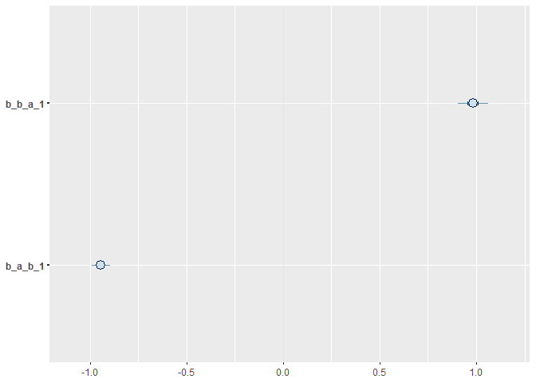
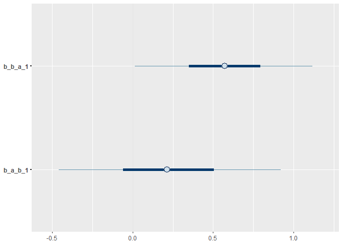
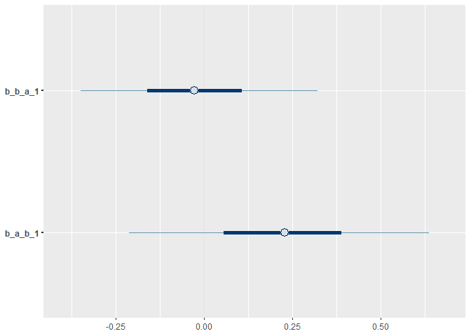
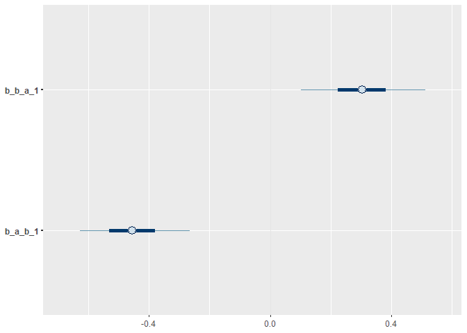
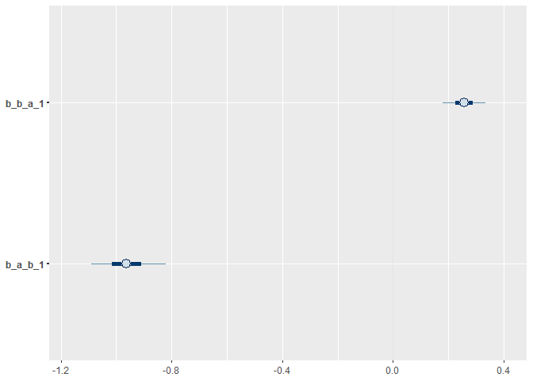

# Example for Figure 2. Reverse causation in simple regression models
Sam Walmsley, Suchinta Arif, Hal Whitehead

This example shows how reciprocal effects between traits can be
extracted from longitudinal datasets. Here we fit a model similar to a
cross-lagged panel model, where two traits are assumed to influence
themselves and one another across successive timesteps.

We begin by loading several key packages:

``` r
library(data.table)
library(ggplot2)
library(dplyr)
library(bayesplot)
library(brms)
library(posterior)
```

``` r
set.seed(12345)
```

## Simple discrete time model

First, we will initialize variables for the simulation. These can be
modified to explore how different effect and sample sizes impact the
estimates that the model recovers. Note however that simulated positive
feedbacks can result in massive values which can be tricky to model.

``` r
# Initialize variables
n_time_steps <- 20

# auto effects (dampening)
a_to_a <- 0.25
b_to_b <- 0.25

# cross effects
a_to_b <- 1
b_to_a <- -1

# Create an empty data frame to store the results
df <- data.frame(
  time = integer(),
  a = numeric(),
  b = numeric())
```

Next, we loop over the time steps allowing the variables A and B to
evolve as a function of both auto-regressive and bi-directional effects.
Finally, we create columns containing lagged values of each variable to
facilitate modelling the effects of previous variable values on current
ones.

``` r
# Initialize starting values
a <- numeric(n_time_steps)
b <- numeric(n_time_steps)
a[1] <- 1
b[1] <- 1

# Loop over time steps
for (t in 2:n_time_steps) {

  # A changes as a function of previous values of A (auto) and B (cross) 
  # plus random variation
  a[t] <- a_to_a * a[t-1] + b_to_a * b[t-1] + rnorm(1, mean = 0, sd = 0.25)
  
  # B changes as a function of previous values of B (auto) and A (cross) 
  # plus random variation
  b[t] <- b_to_b * b[t-1] + a_to_b * a[t-1] + rnorm(1, mean = 0, sd = 0.25)
  
}

# Combine the results into a dataframe
df <- data.frame(
  time = 1:n_time_steps,
  a = a,
  b = b)

# Convert from wide to long format for plotting with ggplot
df_long <- df %>%
  tidyr::pivot_longer(c(a, b), names_to = "trait", values_to = "value")

df <-
  df %>%
  mutate(a_1 = lag(a),
         b_1 = lag(b))
```

Now we are ready to fit the model. First we specify two formulas with A
and B as outcomes, respectively. Each variable is expressed as a
function of itself at a previous timestep, as well as the opposite
variable at a previous timestep.

``` r
library(lavaan)

# Define the cross-lagged model with lagged variables
model <- "
  a ~ a_1 + b_1 
  b ~ b_1 + a_1
"

# Fit the model to your df
fit <- sem(model, data = df)

# Show full model summary
# summary(fit, fit.measures = TRUE, standardized = TRUE)

# Show key parameters 
# (lhs is the outcome, rhs is the predictor or treatment variable)
parameterEstimates(fit, standardized = TRUE)[parameterEstimates(fit)$op == "~", ]
```

      lhs op rhs    est    se       z pvalue ci.lower ci.upper std.lv std.all
    1   a  ~ a_1  0.276 0.024  11.461      0    0.229    0.323  0.276   0.264
    2   a  ~ b_1 -0.945 0.023 -41.436      0   -0.990   -0.901 -0.945  -0.956
    3   b  ~ b_1  0.306 0.036   8.511      0    0.236    0.377  0.306   0.309
    4   b  ~ a_1  0.986 0.038  25.962      0    0.911    1.060  0.986   0.942
      std.nox
    1   0.158
    2  -0.540
    3   0.174
    4   0.561

``` r
f1 <- bf(b ~ 0 + Intercept + b_1 + a_1)
f2 <- bf(a ~ 0 + Intercept + a_1 + b_1)

m <-
  brm(data = df,
      family = 'Gaussian',
      f1 + f2 + set_rescor(TRUE),
      prior = c(prior(normal(0, 1), class = b, resp = b, coef = Intercept),
                prior(normal(0, 1), class = b, resp = a, coef = Intercept),
                prior(normal(0, 1), class = b, resp = b),
                prior(normal(0, 1), class = b, resp = a),
                prior(exponential(1), class = sigma, resp = b),
                prior(exponential(1), class = sigma, resp = a)),
      iter = 4000, warmup = 2000, chains = 4, cores = 4)
```

Next, we can examine the fitted model to see if the simulated (“true”)
cross effects between A and B have been recovered.

``` r
summary(m)
```

     Family: MV(gaussian, gaussian) 
      Links: mu = identity; sigma = identity
             mu = identity; sigma = identity 
    Formula: b ~ 0 + Intercept + b_1 + a_1 
             a ~ 0 + Intercept + a_1 + b_1 
       Data: df (Number of observations: 19) 
      Draws: 4 chains, each with iter = 4000; warmup = 2000; thin = 1;
             total post-warmup draws = 8000

    Population-Level Effects: 
                Estimate Est.Error l-95% CI u-95% CI Rhat Bulk_ESS Tail_ESS
    b_Intercept     0.07      0.08    -0.09     0.23 1.00     8544     5307
    b_b_1           0.30      0.04     0.22     0.39 1.00     8483     6003
    b_a_1           0.98      0.05     0.89     1.07 1.00     9455     5474
    a_Intercept     0.04      0.05    -0.06     0.13 1.00     8519     5531
    a_a_1           0.28      0.03     0.22     0.34 1.00     8376     5943
    a_b_1          -0.94      0.03    -1.00    -0.89 1.00     9678     5408

    Family Specific Parameters: 
            Estimate Est.Error l-95% CI u-95% CI Rhat Bulk_ESS Tail_ESS
    sigma_b     0.34      0.07     0.24     0.50 1.00     7857     5844
    sigma_a     0.21      0.04     0.15     0.32 1.00     6762     5047

    Residual Correlations: 
                Estimate Est.Error l-95% CI u-95% CI Rhat Bulk_ESS Tail_ESS
    rescor(b,a)     0.04      0.24    -0.43     0.49 1.00     7048     5161

    Draws were sampled using sampling(NUTS). For each parameter, Bulk_ESS
    and Tail_ESS are effective sample size measures, and Rhat is the potential
    scale reduction factor on split chains (at convergence, Rhat = 1).

``` r
mcmc_intervals(m, pars=c('b_b_a_1','b_a_b_1'))
```



Yes, the model has accurately recovered the causal, bidirectional
effects. Note that “b_b_a_1” refers to the effect of A on B, while
“b_a_b_1” refers to the effect of B on A, which were simulated as 1 and
-1 respectively.

## Incorporating confounds into discrete time models

Next, we consider the incorporation of a simple confound, C, which
influences both focal variables A and B. Here we assume that C is a
time-invariant confound, and that it changes simply as a function of its
own previous values with random noise.

### Example with hallucinated cross-lagged effects

For this example, we will simulate a situation in which A and B have no
effects on one another. However, common influence from C, if ignored,
may result in spurious estimates of bidirectional effects.

First, we will initialize variables for the simulation. These can be
modified to explore how different effect and sample sizes impact the
estimates that the model recovers. Note that we have included new
effects for the common-cause confound, “C”.

``` r
# Initialize variables
n_time_steps <- 20

# auto effects (dampening)
a_to_a <- 0.25
b_to_b <- 0.25
c_to_c <- 1

# cross effects
a_to_b <- 0.0
b_to_a <- 0.0

# add in confound
c_to_a <- 2
c_to_b <- 2

# Create an empty data frame to store the results
df <- data.frame(
  time = integer(),
  a = numeric(),
  b = numeric(),
  c = numeric())
```

As before, we simulate the temporal process by which A, B, and C change
in response to one another over each time step. We also need to create
lagged versions of each variable for modelling.

``` r
# Initialize starting values
a <- numeric(n_time_steps)
b <- numeric(n_time_steps)
c <- numeric(n_time_steps)

a[1] <- 1
b[1] <- 1
c[1] <- 1

# Loop over time steps
for (t in 2:n_time_steps) {

  # A changes as a function of previous values of A (auto) and B (cross) 
  # plus confound and random variation
  a[t] <- (a_to_a * a[t-1]) + (b_to_a * b[t-1]) + (c_to_a * c[t-1]) + rnorm(1, mean = 0, sd = 0.25)
  
  # B changes as a function of previous values of B (auto) and A (cross) 
  # plus confound and random variation
  b[t] <- (b_to_b * b[t-1]) + (a_to_b * a[t-1]) + (c_to_b * c[t-1]) + rnorm(1, mean = 0, sd = 0.25)
  
  # C changes as a function of previous values of C (auto)
  c[t] <- (c_to_c * c[t-1]) + rnorm(1, mean = 0, sd = 0.25)
  
}

# Combine the results into a dataframe
df <- data.frame(
  time = 1:n_time_steps,
  a = a,
  b = b,
  c = c)


# Convert from wide to long format for plotting with ggplot
df_long <- df %>%
  tidyr::pivot_longer(c(a, b), names_to = "trait", values_to = "value")


df <-
  df %>%
  mutate(a_1 = lag(a),
         b_1 = lag(b),
         c_1 = lag(c))
```

First, we attempt a simple model without conditioning on the simulated
confound, C.

``` r
f1 <- bf(b ~ 0 + Intercept + b_1 + a_1)
f2 <- bf(a ~ 0 + Intercept + a_1 + b_1)

m <-
  brm(data = df,
      family = 'Gaussian',
      f1 + f2 + set_rescor(TRUE),
      prior = c(prior(normal(0, 1), class = b, resp = b, coef = Intercept),
                prior(normal(0, 1), class = b, resp = a, coef = Intercept),
                prior(normal(0, 1), class = b, resp = b),
                prior(normal(0, 1), class = b, resp = a),
                prior(exponential(1), class = sigma, resp = b),
                prior(exponential(1), class = sigma, resp = a)),
      iter = 4000, warmup = 2000, chains = 4, cores = 4)
```

As we can see in the model summary, the model does not confidently
identify a lack of bidirectional effects between A and B. In fact, it is
fairly confident in a spurious (non-causal) effect of A on B.

``` r
summary(m)
```

     Family: MV(gaussian, gaussian) 
      Links: mu = identity; sigma = identity
             mu = identity; sigma = identity 
    Formula: b ~ 0 + Intercept + b_1 + a_1 
             a ~ 0 + Intercept + a_1 + b_1 
       Data: df (Number of observations: 19) 
      Draws: 4 chains, each with iter = 4000; warmup = 2000; thin = 1;
             total post-warmup draws = 8000

    Population-Level Effects: 
                Estimate Est.Error l-95% CI u-95% CI Rhat Bulk_ESS Tail_ESS
    b_Intercept     0.70      0.34     0.02     1.36 1.00     3340     4023
    b_b_1           0.34      0.35    -0.34     1.03 1.00     2417     3453
    b_a_1           0.57      0.33    -0.08     1.22 1.00     2543     3875
    a_Intercept     0.35      0.41    -0.47     1.14 1.00     3410     4024
    a_a_1           0.78      0.39     0.01     1.56 1.00     2552     3839
    a_b_1           0.21      0.42    -0.61     1.03 1.00     2448     3666

    Family Specific Parameters: 
            Estimate Est.Error l-95% CI u-95% CI Rhat Bulk_ESS Tail_ESS
    sigma_b     0.66      0.12     0.48     0.94 1.00     3283     3518
    sigma_a     0.81      0.14     0.59     1.13 1.00     3438     4009

    Residual Correlations: 
                Estimate Est.Error l-95% CI u-95% CI Rhat Bulk_ESS Tail_ESS
    rescor(b,a)     0.83      0.09     0.61     0.94 1.00     3419     4360

    Draws were sampled using sampling(NUTS). For each parameter, Bulk_ESS
    and Tail_ESS are effective sample size measures, and Rhat is the potential
    scale reduction factor on split chains (at convergence, Rhat = 1).

``` r
mcmc_intervals(m, pars=c('b_b_a_1','b_a_b_1'))
```



Next, we apply a model that conditions on C. By including the effects of
C at t-1 on values of A and B at time t, we are controlling for the
confound and we hope to recover accurate estimates of the (lack!) of
bidirectional effects between A and B.

``` r
f1 <- bf(b ~ 0 + Intercept + b_1 + a_1 + c_1)
f2 <- bf(a ~ 0 + Intercept + a_1 + b_1 + c_1)

m <-
  brm(data = df,
      family = 'Gaussian',
      f1 + f2 + set_rescor(TRUE),
      prior = c(prior(normal(0, 1), class = b, resp = b, coef = Intercept),
                prior(normal(0, 1), class = b, resp = a, coef = Intercept),
                prior(normal(0, 1), class = b, resp = b),
                prior(normal(0, 1), class = b, resp = a),
                prior(exponential(1), class = sigma, resp = b),
                prior(exponential(1), class = sigma, resp = a)),
      iter = 4000, warmup = 2000, chains = 4, cores = 4)

summary(m)
```

``` r
summary(m)
```

     Family: MV(gaussian, gaussian) 
      Links: mu = identity; sigma = identity
             mu = identity; sigma = identity 
    Formula: b ~ 0 + Intercept + b_1 + a_1 + c_1 
             a ~ 0 + Intercept + a_1 + b_1 + c_1 
       Data: df (Number of observations: 19) 
      Draws: 4 chains, each with iter = 4000; warmup = 2000; thin = 1;
             total post-warmup draws = 8000

    Population-Level Effects: 
                Estimate Est.Error l-95% CI u-95% CI Rhat Bulk_ESS Tail_ESS
    b_Intercept     0.17      0.19    -0.19     0.56 1.00     3842     3931
    b_b_1           0.36      0.20    -0.04     0.74 1.00     3450     4016
    b_a_1          -0.02      0.21    -0.42     0.40 1.00     3311     3638
    b_c_1           1.73      0.22     1.25     2.15 1.00     4393     3717
    a_Intercept    -0.27      0.25    -0.74     0.24 1.00     3904     4741
    a_a_1           0.09      0.27    -0.42     0.65 1.00     3415     3887
    a_b_1           0.22      0.26    -0.31     0.73 1.00     3667     4071
    a_c_1           2.03      0.28     1.43     2.55 1.00     4663     4598

    Family Specific Parameters: 
            Estimate Est.Error l-95% CI u-95% CI Rhat Bulk_ESS Tail_ESS
    sigma_b     0.29      0.06     0.20     0.43 1.00     4737     4609
    sigma_a     0.37      0.08     0.26     0.55 1.00     4302     5132

    Residual Correlations: 
                Estimate Est.Error l-95% CI u-95% CI Rhat Bulk_ESS Tail_ESS
    rescor(b,a)     0.18      0.24    -0.31     0.61 1.00     4457     5111

    Draws were sampled using sampling(NUTS). For each parameter, Bulk_ESS
    and Tail_ESS are effective sample size measures, and Rhat is the potential
    scale reduction factor on split chains (at convergence, Rhat = 1).

``` r
mcmc_intervals(m, pars=c('b_b_a_1','b_a_b_1'))
```



As expected, the correctly adjusted model recovers the lack of causal
effects between A and B.

### Example with inaccurate cross-lagged effects

In this example we will consider situations in which non-zero
bidirectional effects are present, but the confound impacts our ability
to estimate them accurately.

First, we will initialize variables for the simulation. These can be
modified to explore how different effect and sample sizes impact the
estimates that the model recovers. Here we simulate strong effects of
the confound C, a weak positive effect of A on B, and a stronger
negative effect of B on A.

``` r
# Initialize variables
n_time_steps <- 20

# auto effects (dampening)
a_to_a <- 0.25
b_to_b <- 0.25
c_to_c <- 1

# cross effects
a_to_b <- 0.25
b_to_a <- -1

# add in confound
c_to_a <- 2
c_to_b <- 2

# Create an empty data frame to store the results
df <- data.frame(
  time = integer(),
  a = numeric(),
  b = numeric(),
  c = numeric())
```

``` r
# Initialize starting values
a <- numeric(n_time_steps)
b <- numeric(n_time_steps)
c <- numeric(n_time_steps)

a[1] <- 1
b[1] <- 1
c[1] <- 1

# Loop over time steps
for (t in 2:n_time_steps) {

  # A changes as a function of previous values of A (auto) and B (cross) 
  # plus confound and random variation
  a[t] <- (a_to_a * a[t-1]) + (b_to_a * b[t-1]) + (c_to_a * c[t-1]) + rnorm(1, mean = 0, sd = 0.1)
  
  # B changes as a function of previous values of A (auto) and B (cross) 
  # plus confound and random variation
  b[t] <- (b_to_b * b[t-1]) + (a_to_b * a[t-1]) + (c_to_b * c[t-1]) + rnorm(1, mean = 0, sd = 0.1)
  
  # C changes as a function of previous values of C (auto)
  c[t] <- c_to_c*c[t-1] + rnorm(1, mean = 0, sd = 0.1)
  
}

# Combine the results into a dataframe
df <- data.frame(
  time = 1:n_time_steps,
  a = a,
  b = b,
  c = c)

# Convert from wide to long format for plotting with ggplot
df_long <- df %>%
  tidyr::pivot_longer(c(a, b), names_to = "trait", values_to = "value")

df <-
  df %>%
  mutate(a_1 = lag(a),
         b_1 = lag(b),
         c_1 = lag(c))
```

Here we fit a simple model with cross-lagged effects in which we do not
explicitly control for the confound, C.

``` r
f1 <- bf(b ~ 0 + Intercept + b_1 + a_1)
f2 <- bf(a ~ 0 + Intercept + a_1 + b_1)

m <-
  brm(data = df,
      family = 'Gaussian',
      f1 + f2 + set_rescor(TRUE),
      prior = c(prior(normal(0, 1), class = b, resp = b, coef = Intercept),
                prior(normal(0, 1), class = b, resp = a, coef = Intercept),
                prior(normal(0, 1), class = b, resp = b),
                prior(normal(0, 1), class = b, resp = a),
                prior(exponential(1), class = sigma, resp = b),
                prior(exponential(1), class = sigma, resp = a)),
      iter = 4000, warmup = 2000, chains = 4, cores = 4)

summary(m)
```

``` r
summary(m)
```

     Family: MV(gaussian, gaussian) 
      Links: mu = identity; sigma = identity
             mu = identity; sigma = identity 
    Formula: b ~ 0 + Intercept + b_1 + a_1 
             a ~ 0 + Intercept + a_1 + b_1 
       Data: df (Number of observations: 19) 
      Draws: 4 chains, each with iter = 4000; warmup = 2000; thin = 1;
             total post-warmup draws = 8000

    Population-Level Effects: 
                Estimate Est.Error l-95% CI u-95% CI Rhat Bulk_ESS Tail_ESS
    b_Intercept     1.01      0.34     0.32     1.65 1.00     2128     2572
    b_b_1           0.78      0.11     0.57     1.01 1.00     2031     2434
    b_a_1           0.30      0.13     0.06     0.56 1.00     2815     3406
    a_Intercept     1.00      0.34     0.31     1.64 1.00     2007     2631
    a_a_1           0.33      0.13     0.08     0.59 1.00     2814     2961
    a_b_1          -0.45      0.11    -0.67    -0.22 1.00     1974     2421

    Family Specific Parameters: 
            Estimate Est.Error l-95% CI u-95% CI Rhat Bulk_ESS Tail_ESS
    sigma_b     0.34      0.06     0.24     0.49 1.00     2918     3311
    sigma_a     0.34      0.06     0.24     0.49 1.00     2847     3343

    Residual Correlations: 
                Estimate Est.Error l-95% CI u-95% CI Rhat Bulk_ESS Tail_ESS
    rescor(b,a)     0.83      0.09     0.62     0.94 1.00     2658     4001

    Draws were sampled using sampling(NUTS). For each parameter, Bulk_ESS
    and Tail_ESS are effective sample size measures, and Rhat is the potential
    scale reduction factor on split chains (at convergence, Rhat = 1).

``` r
mcmc_intervals(m, pars=c('b_b_a_1','b_a_b_1'))
```



As we can see in the above model summary, we do not recover the
simulated effects of A on B (0.25) or B on A (-1) accurately. The
effects are roughly similar in direction and magnitude however,
suggesting that the model is still picking up some of what we simulated,
even with confounding. Of course the extent to which this is true will
depend on the causal scenario and effect size at hand.

Next, we fit the more causally appropriate model in which we condition
on the known confound.

``` r
f1 <- bf(b ~ 0 + Intercept + b_1 + a_1 + c_1)
f2 <- bf(a ~ 0 + Intercept + a_1 + b_1 + c_1)

m <-
  brm(data = df,
      family = 'Gaussian',
      f1 + f2 + set_rescor(TRUE),
      prior = c(prior(normal(0, 1), class = b, resp = b, coef = Intercept),
                prior(normal(0, 1), class = b, resp = a, coef = Intercept),
                prior(normal(0, 1), class = b, resp = b),
                prior(normal(0, 1), class = b, resp = a),
                prior(exponential(1), class = sigma, resp = b),
                prior(exponential(1), class = sigma, resp = a)),
      iter = 4000, warmup = 2000, chains = 4, cores = 4)
```

``` r
summary(m)
```

     Family: MV(gaussian, gaussian) 
      Links: mu = identity; sigma = identity
             mu = identity; sigma = identity 
    Formula: b ~ 0 + Intercept + b_1 + a_1 + c_1 
             a ~ 0 + Intercept + a_1 + b_1 + c_1 
       Data: df (Number of observations: 19) 
      Draws: 4 chains, each with iter = 4000; warmup = 2000; thin = 1;
             total post-warmup draws = 8000

    Population-Level Effects: 
                Estimate Est.Error l-95% CI u-95% CI Rhat Bulk_ESS Tail_ESS
    b_Intercept    -0.00      0.19    -0.35     0.38 1.00     4534     4680
    b_b_1           0.25      0.07     0.12     0.39 1.00     4067     4128
    b_a_1           0.26      0.05     0.16     0.35 1.00     5650     5103
    b_c_1           1.99      0.21     1.54     2.38 1.00     3538     3944
    a_Intercept     0.05      0.23    -0.38     0.54 1.00     4947     4522
    a_a_1           0.28      0.06     0.17     0.40 1.00     5687     5015
    a_b_1          -0.96      0.08    -1.12    -0.78 1.00     4853     4094
    a_c_1           1.88      0.26     1.33     2.35 1.00     3876     3928

    Family Specific Parameters: 
            Estimate Est.Error l-95% CI u-95% CI Rhat Bulk_ESS Tail_ESS
    sigma_b     0.12      0.03     0.09     0.18 1.00     4982     4344
    sigma_a     0.15      0.03     0.10     0.23 1.00     4526     4572

    Residual Correlations: 
                Estimate Est.Error l-95% CI u-95% CI Rhat Bulk_ESS Tail_ESS
    rescor(b,a)     0.09      0.24    -0.39     0.56 1.00     4949     4986

    Draws were sampled using sampling(NUTS). For each parameter, Bulk_ESS
    and Tail_ESS are effective sample size measures, and Rhat is the potential
    scale reduction factor on split chains (at convergence, Rhat = 1).

``` r
mcmc_intervals(m, pars=c('b_b_a_1','b_a_b_1'))
```



Here, as expected, we recover more accurate estimates of the direct
effects of A on B and of B on A.

## Sum-up

Here we have shown that temporally-explicit causal models with lag terms
can accurately recover bidirectional effects. However, this model
structure is not immune to the more general challenges of causal
inference. Specifically, we show that it may be necessary to consider
other causal pathologies (e.g.,confounding) in order to generate
accurate causal inferences.
