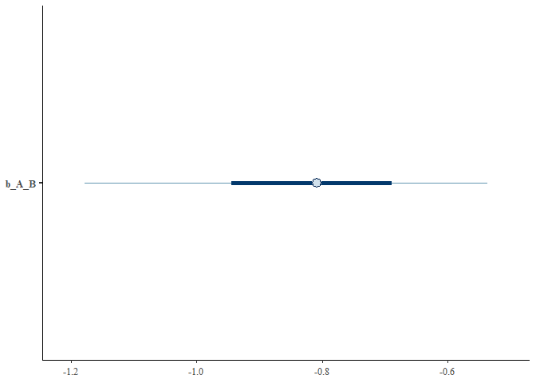

# Method 3. Instrumental variable analysis
Sam Walmsley, Suchinta Arif, Hal Whitehead

## Part 1. Applying the instrumental variable model

This example shows how reciprocal effects between traits can be
extracted from purely cross-sectional data, if appropriate instrumental
variables can be identified.

We begin by loading several key packages:

``` r
library(data.table)
library(ggplot2)
library(dplyr)
library(sjPlot)
library(brms)
library(AER)
library(bayesplot)
```

Next, we will initialize variables for the simulation. These can be
modified to explore how different effect and sample sizes impact the
estimates that the model recovers.

``` r
set.seed(1234)
n <- 100

Instrument_1 <- rnorm(n)
Instrument_2 <- rnorm(n)

A_initial <- rnorm(n) + 1*Instrument_2 # initial values of A and B are influenced by their respective instruments
B_initial <- rnorm(n) + 1*Instrument_1

A <- A_initial + (-1)*B_initial # A is influenced by instrument_2 and B 
B <- B_initial + (1)*A_initial # B is influenced by instrument_1 and A

# Create a dataframe
data <- data.frame(A, B, Instrument_1, Instrument_2)
```

Next, we can use each instrument to identify the direct effects in turn.
First, we will do so using the AER package. Though somewhat less
flexible than brms, these models run significantly faster and are ideal
for simple IV models like this one. More specifically, we use the AER
package to apply the 2SLS algorithm. Note that there is one model for
each directional effect in question.

``` r
# Perform the 2SLS regression for effect of B on A
ivmodel <- ivreg(A ~ B | Instrument_1, data = data)
summary(ivmodel, diagnostics=TRUE)
```


    Call:
    ivreg(formula = A ~ B | Instrument_1, data = data)

    Residuals:
         Min       1Q   Median       3Q      Max 
    -7.37704 -1.72088  0.08888  1.42670  7.98012 

    Coefficients:
                Estimate Std. Error t value Pr(>|t|)    
    (Intercept)   0.3890     0.2822   1.378 0.171261    
    B            -0.9131     0.2352  -3.882 0.000188 ***

    Diagnostic tests:
                     df1 df2 statistic  p-value    
    Weak instruments   1  98     39.13 1.04e-08 ***
    Wu-Hausman         1  97     58.38 1.54e-11 ***
    Sargan             0  NA        NA       NA    
    ---
    Signif. codes:  0 '***' 0.001 '**' 0.01 '*' 0.05 '.' 0.1 ' ' 1

    Residual standard error: 2.821 on 98 degrees of freedom
    Multiple R-Squared: -0.9357,    Adjusted R-squared: -0.9554 
    Wald test: 15.07 on 1 and 98 DF,  p-value: 0.0001881 

``` r
# Perform the 2SLS regression for effect of A on B
ivmodel <- ivreg(B ~ A | Instrument_2, data = data) # gives expected result for A_initial, not A
summary(ivmodel, diagnostics=TRUE)
```


    Call:
    ivreg(formula = B ~ A | Instrument_2, data = data)

    Residuals:
         Min       1Q   Median       3Q      Max 
    -8.88247 -2.60545 -0.05111  2.53820 10.63011 

    Coefficients:
                Estimate Std. Error t value Pr(>|t|)    
    (Intercept)  -0.4211     0.3719  -1.132  0.26027    
    A             1.2534     0.3529   3.552  0.00059 ***

    Diagnostic tests:
                     df1 df2 statistic  p-value    
    Weak instruments   1  98     31.51 1.85e-07 ***
    Wu-Hausman         1  97     77.38 5.30e-14 ***
    Sargan             0  NA        NA       NA    
    ---
    Signif. codes:  0 '***' 0.001 '**' 0.01 '*' 0.05 '.' 0.1 ' ' 1

    Residual standard error: 3.495 on 98 degrees of freedom
    Multiple R-Squared: -1.374, Adjusted R-squared: -1.398 
    Wald test: 12.61 on 1 and 98 DF,  p-value: 0.0005905 

As shown in the model summaries, the IV models accurately recover the
simulated effects of B on A (-1) and A on B (1). Next, we fit a Bayesian
version of these IV models using the brms package.

Finally, we will assess the results of the Bayesian IV models. As
before, the model has recovered the simulated, causal effects between A
and B. Note that b_B_A represents the effect of A on B while b_A_B
represents the effect of B on A. It is also important to note that
accurate inference from IV models requires adequately strong instruments
(see diagnostic checks in AER summary output, for example), and will
also depend on sample size. See Grace (2021) for additional information.

``` r
# output of model to identify causal effect of B on A
summary(iv_model)
```

     Family: MV(gaussian, gaussian) 
      Links: mu = identity; sigma = identity
             mu = identity; sigma = identity 
    Formula: B ~ 1 + Instrument_1 
             A ~ 1 + B 
       Data: d (Number of observations: 100) 
      Draws: 4 chains, each with iter = 10000; warmup = 5000; thin = 1;
             total post-warmup draws = 20000

    Population-Level Effects: 
                   Estimate Est.Error l-95% CI u-95% CI Rhat Bulk_ESS Tail_ESS
    B_Intercept        0.21      0.19    -0.15     0.58 1.00    11785    13367
    A_Intercept        0.36      0.25    -0.14     0.86 1.00    11641    12428
    B_Instrument_1     1.25      0.17     0.92     1.59 1.00     9154    10655
    A_B               -0.83      0.20    -1.27    -0.49 1.00     7666     8155

    Family Specific Parameters: 
            Estimate Est.Error l-95% CI u-95% CI Rhat Bulk_ESS Tail_ESS
    sigma_B     1.90      0.13     1.66     2.18 1.00    12613    12356
    sigma_A     2.67      0.34     2.12     3.46 1.00     7599     8482

    Residual Correlations: 
                Estimate Est.Error l-95% CI u-95% CI Rhat Bulk_ESS Tail_ESS
    rescor(B,A)     0.78      0.06     0.64     0.89 1.00     7683     8931

    Draws were sampled using sampling(NUTS). For each parameter, Bulk_ESS
    and Tail_ESS are effective sample size measures, and Rhat is the potential
    scale reduction factor on split chains (at convergence, Rhat = 1).

``` r
mcmc_intervals(iv_model, pars='b_A_B')
```



``` r
# output of model to identify causal effect of A on B
summary(iv_model_2)
```

     Family: MV(gaussian, gaussian) 
      Links: mu = identity; sigma = identity
             mu = identity; sigma = identity 
    Formula: A ~ 1 + Instrument_2 
             B ~ 1 + A 
       Data: d (Number of observations: 100) 
      Draws: 4 chains, each with iter = 10000; warmup = 5000; thin = 1;
             total post-warmup draws = 20000

    Population-Level Effects: 
                   Estimate Est.Error l-95% CI u-95% CI Rhat Bulk_ESS Tail_ESS
    A_Intercept        0.31      0.17    -0.02     0.63 1.00    11111    11851
    B_Intercept       -0.34      0.31    -0.98     0.25 1.00    10462    10128
    A_Instrument_2     1.05      0.15     0.78     1.36 1.00     7895     9457
    B_A                1.05      0.26     0.61     1.60 1.00     6461     7437

    Family Specific Parameters: 
            Estimate Est.Error l-95% CI u-95% CI Rhat Bulk_ESS Tail_ESS
    sigma_A     1.75      0.12     1.53     2.01 1.00    13111    11901
    sigma_B     3.15      0.42     2.47     4.10 1.00     6381     7316

    Residual Correlations: 
                Estimate Est.Error l-95% CI u-95% CI Rhat Bulk_ESS Tail_ESS
    rescor(A,B)    -0.83      0.05    -0.91    -0.71 1.00     6441     7539

    Draws were sampled using sampling(NUTS). For each parameter, Bulk_ESS
    and Tail_ESS are effective sample size measures, and Rhat is the potential
    scale reduction factor on split chains (at convergence, Rhat = 1).

``` r
mcmc_intervals(iv_model_2, pars='b_B_A')
```


<div id="refs" class="references csl-bib-body hanging-indent">

<div id="ref-graceInstrumentalVariableMethods2021" class="csl-entry">

Grace, James B. 2021. “Instrumental Variable Methods in Structural
Equation Models.” *Methods in Ecology and Evolution* 12 (7): 1148–57.
<https://doi.org/10.1111/2041-210X.13600>.

</div>

</div>
