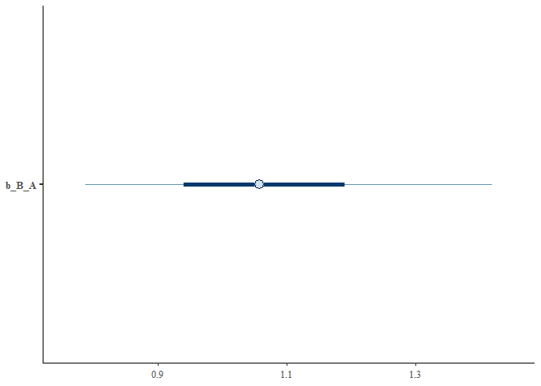

# Method 3. Instrumental variable analysis
Authors anonymized for peer review.

``` r
set.seed(12345)
```

## Part 1. Applying the instrumental variable model

This example shows how reciprocal effects between traits can be
extracted from purely cross-sectional data, if appropriate instrumental
variables can be identified.

We begin by loading several key packages:

``` r
library(data.table)
library(ggplot2)
library(dplyr)
library(sjPlot)
library(brms)
library(AER)
library(bayesplot)
```

Next, we will initialize variables for the simulation. These can be
modified to explore how different effect and sample sizes impact the
estimates that the model recovers.

``` r
set.seed(1234)
n <- 200

Instrument_1 <- rnorm(n)
Instrument_2 <- rnorm(n)

A_initial <- rnorm(n) + 1*Instrument_2 # initial values of A and B are influenced by their respective instruments
B_initial <- rnorm(n) + 1*Instrument_1

A <- A_initial + (-1)*B_initial # A is influenced by instrument_2 and B 
B <- B_initial + (1)*A_initial # B is influenced by instrument_1 and A

# Create a dataframe
data <- data.frame(A, B, Instrument_1, Instrument_2)
```

Next, we can use each instrument to identify the direct effects in turn.
First, we will do so using the AER package. Though somewhat less
flexible than brms, these models run significantly faster and are ideal
for simple IV models like this one. More specifically, we use the AER
package to apply the 2SLS algorithm. Note that there is one model for
each directional effect in question.

``` r
# Perform the 2SLS regression for effect of B on A
ivmodel <- ivreg(A ~ B | Instrument_1, data = data)
summary(ivmodel, diagnostics=TRUE)
```


    Call:
    ivreg(formula = A ~ B | Instrument_1, data = data)

    Residuals:
        Min      1Q  Median      3Q     Max 
    -7.2151 -1.6866  0.1511  1.8790  8.6685 

    Coefficients:
                 Estimate Std. Error t value Pr(>|t|)    
    (Intercept) -0.003314   0.201919  -0.016    0.987    
    B           -0.918193   0.171361  -5.358 2.32e-07 ***

    Diagnostic tests:
                     df1 df2 statistic p-value    
    Weak instruments   1 198     91.48  <2e-16 ***
    Wu-Hausman         1 197    130.35  <2e-16 ***
    Sargan             0  NA        NA      NA    
    ---
    Signif. codes:  0 '***' 0.001 '**' 0.01 '*' 0.05 '.' 0.1 ' ' 1

    Residual standard error: 2.844 on 198 degrees of freedom
    Multiple R-Squared: -0.8618,    Adjusted R-squared: -0.8712 
    Wald test: 28.71 on 1 and 198 DF,  p-value: 2.323e-07 

``` r
# Perform the 2SLS regression for effect of A on B
ivmodel <- ivreg(B ~ A | Instrument_2, data = data) # gives expected result for A_initial, not A
summary(ivmodel, diagnostics=TRUE)
```


    Call:
    ivreg(formula = B ~ A | Instrument_2, data = data)

    Residuals:
        Min      1Q  Median      3Q     Max 
    -7.7840 -2.0406 -0.2737  2.0934 10.0125 

    Coefficients:
                Estimate Std. Error t value Pr(>|t|)    
    (Intercept)  -0.2220     0.2298  -0.966    0.335    
    A             1.1851     0.2352   5.039 1.05e-06 ***

    Diagnostic tests:
                     df1 df2 statistic  p-value    
    Weak instruments   1 198      55.8 2.51e-12 ***
    Wu-Hausman         1 197     124.9  < 2e-16 ***
    Sargan             0  NA        NA       NA    
    ---
    Signif. codes:  0 '***' 0.001 '**' 0.01 '*' 0.05 '.' 0.1 ' ' 1

    Residual standard error: 3.234 on 198 degrees of freedom
    Multiple R-Squared: -1.377, Adjusted R-squared: -1.389 
    Wald test: 25.39 on 1 and 198 DF,  p-value: 1.052e-06 

As shown in the model summaries, the IV models accurately recover the
simulated effects of B on A (-1) and A on B (1). Next, we fit a Bayesian
version of these IV models using the brms package.

``` r
# model to identify causal effect of B on A
d <- data.frame(B, Instrument_1, Instrument_2, A)
f1 <- bf(B ~ 1 + Instrument_1)
f2 <- bf(A ~ 1 + B)
iv_model <- brm(f1 + f2 + set_rescor(TRUE),
                data=d, 
                prior = c(# First model
                          prior(normal(0, 1), class = Intercept, resp = B),
                          prior(normal(0, 1), class = b, resp = B),
                          prior(exponential(1), class = sigma, resp = B),

                          # Second model
                          prior(normal(0, 1), class = Intercept, resp = A),
                          prior(normal(0, 1), class = b, resp = A),
                          prior(exponential(1), class = sigma, resp = A)),

                iter = 10000, warmup = 5000, chains = 4, cores = 4,
                family = 'Gaussian')

# model to identify causal effect of A on B
d <- data.frame(B, Instrument_1, Instrument_2, A)
f1 <- bf(A ~ 1 + Instrument_2)
f2 <- bf(B ~ 1 + A)
iv_model_2 <- brm(f1 + f2 + set_rescor(TRUE),
                data=d, 
                prior = c(# First model
                  prior(normal(0, 1), class = Intercept, resp = B),
                  prior(normal(0, 1), class = b, resp = B),
                  prior(exponential(1), class = sigma, resp = B),
                  
                  # Second model
                  prior(normal(0, 1), class = Intercept, resp = A),
                  prior(normal(0, 1), class = b, resp = A),
                  prior(exponential(1), class = sigma, resp = A)),
                  
                iter = 10000, warmup = 5000, chains = 4, cores = 4,
                family = 'Gaussian')
```

Finally, we will assess the results of the Bayesian IV models. As
before, the model has recovered the simulated, causal effects between A
and B. Note that b_B_A represents the effect of A on B while b_A_B
represents the effect of B on A. It is also important to note that
accurate inference from IV models requires adequately strong instruments
(see diagnostic checks in AER summary output, for example), and will
also depend on sample size. See Grace (2021) for additional information.

``` r
# output of model to identify causal effect of B on A
summary(iv_model)
```

     Family: MV(gaussian, gaussian) 
      Links: mu = identity; sigma = identity
             mu = identity; sigma = identity 
    Formula: B ~ 1 + Instrument_1 
             A ~ 1 + B 
       Data: d (Number of observations: 200) 
      Draws: 4 chains, each with iter = 10000; warmup = 5000; thin = 1;
             total post-warmup draws = 20000

    Population-Level Effects: 
                   Estimate Est.Error l-95% CI u-95% CI Rhat Bulk_ESS Tail_ESS
    B_Intercept       -0.04      0.12    -0.28     0.20 1.00    10690    10448
    A_Intercept        0.00      0.19    -0.38     0.38 1.00    10617    10488
    B_Instrument_1     1.18      0.11     0.96     1.40 1.00     8331     9932
    A_B               -0.87      0.16    -1.20    -0.60 1.00     7057     8453

    Family Specific Parameters: 
            Estimate Est.Error l-95% CI u-95% CI Rhat Bulk_ESS Tail_ESS
    sigma_B     1.73      0.09     1.57     1.91 1.00    13081    11515
    sigma_A     2.77      0.26     2.34     3.34 1.00     7247     8415

    Residual Correlations: 
                Estimate Est.Error l-95% CI u-95% CI Rhat Bulk_ESS Tail_ESS
    rescor(B,A)     0.80      0.04     0.71     0.88 1.00     7356     9068

    Draws were sampled using sampling(NUTS). For each parameter, Bulk_ESS
    and Tail_ESS are effective sample size measures, and Rhat is the potential
    scale reduction factor on split chains (at convergence, Rhat = 1).

``` r
mcmc_intervals(iv_model, pars='b_A_B')
```


``` r
# output of model to identify causal effect of A on B
summary(iv_model_2)
```

     Family: MV(gaussian, gaussian) 
      Links: mu = identity; sigma = identity
             mu = identity; sigma = identity 
    Formula: A ~ 1 + Instrument_2 
             B ~ 1 + A 
       Data: d (Number of observations: 200) 
      Draws: 4 chains, each with iter = 10000; warmup = 5000; thin = 1;
             total post-warmup draws = 20000

    Population-Level Effects: 
                   Estimate Est.Error l-95% CI u-95% CI Rhat Bulk_ESS Tail_ESS
    A_Intercept        0.02      0.13    -0.23     0.27 1.00    10043    10495
    B_Intercept       -0.20      0.21    -0.62     0.20 1.00    10093    10137
    A_Instrument_2     1.02      0.12     0.79     1.26 1.00     8311     9932
    B_A                1.07      0.19     0.73     1.50 1.00     6868     8211

    Family Specific Parameters: 
            Estimate Est.Error l-95% CI u-95% CI Rhat Bulk_ESS Tail_ESS
    sigma_A     1.83      0.09     1.66     2.02 1.00    13159    11270
    sigma_B     3.05      0.33     2.50     3.78 1.00     6861     8172

    Residual Correlations: 
                Estimate Est.Error l-95% CI u-95% CI Rhat Bulk_ESS Tail_ESS
    rescor(A,B)    -0.83      0.04    -0.90    -0.75 1.00     7091     7957

    Draws were sampled using sampling(NUTS). For each parameter, Bulk_ESS
    and Tail_ESS are effective sample size measures, and Rhat is the potential
    scale reduction factor on split chains (at convergence, Rhat = 1).

``` r
mcmc_intervals(iv_model_2, pars='b_B_A')
```



<div id="refs" class="references csl-bib-body hanging-indent">

<div id="ref-graceInstrumentalVariableMethods2021" class="csl-entry">

Grace, James B. 2021. “Instrumental Variable Methods in Structural
Equation Models.” *Methods in Ecology and Evolution* 12 (7): 1148–57.
<https://doi.org/10.1111/2041-210X.13600>.

</div>

</div>
