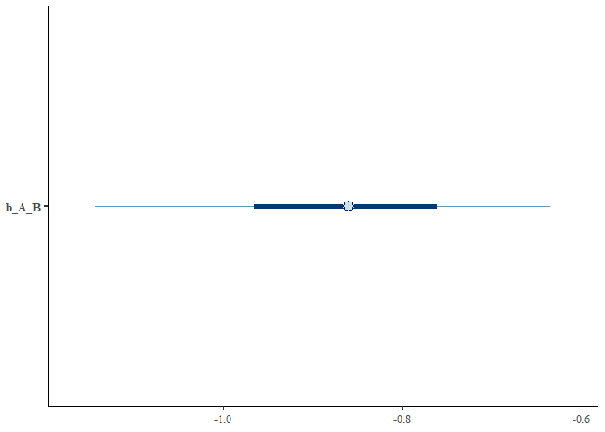

# Method 3. Instrumental variable analysis
Sam Walmsley, Suchinta Arif, Hal Whitehead

This example shows how reciprocal effects between traits can be
extracted from purely cross-sectional data, if appropriate instrumental
variables can be identified.

``` r
set.seed(12345)
```

We begin by loading several key packages:

``` r
library(data.table)
library(ggplot2)
library(dplyr)
library(sjPlot)
library(brms)
library(ivreg)
library(bayesplot)
```

Next, we will initialize variables for the simulation. These can be
modified to explore how different effect and sample sizes impact the
estimates that the model recovers.

``` r
n <- 200

Instrument_1 <- rnorm(n)
Instrument_2 <- rnorm(n)

# initial values of A and B are influenced by their respective instruments
A_initial <- rnorm(n) + 2*Instrument_2 
B_initial <- rnorm(n) + 2*Instrument_1

A <- A_initial + (-1)*B_initial # A is influenced by instrument_2 and B 
B <- B_initial + (1)*A_initial # B is influenced by instrument_1 and A

# Create a dataframe
data <- data.frame(A, B, Instrument_1, Instrument_2)
```

Next, we can use each instrument to identify the direct effects in turn.
First, we will do so using the ivreg function, available from the AER or
ivreg packages. Though somewhat less flexible than brms, these models
run significantly faster and are easier to implement than Bayesian
approaches, e.g., in that they do not require the specification of
priors. This may make them preferable for simpler instrumental variable
models like this one. More specifically, we use the AER package to apply
the 2SLS algorithm. Note that there is one model for each directional
effect in question. See main text for additional information on
instrumental variable methods.

``` r
# Perform the 2SLS regression for effect of B on A
ivmodel <- ivreg(A ~ B | Instrument_1, data = data)
summary(ivmodel, diagnostics=TRUE)
```


    Call:
    ivreg(formula = A ~ B | Instrument_1, data = data)

    Residuals:
         Min       1Q   Median       3Q      Max 
    -13.3190  -2.4147  -0.0316   2.5445  11.9013 

    Coefficients:
                Estimate Std. Error t value Pr(>|t|)    
    (Intercept)   0.3084     0.3045   1.013    0.312    
    B            -0.8842     0.1290  -6.857 8.77e-11 ***

    Diagnostic tests:
                     df1 df2 statistic p-value    
    Weak instruments   1 198     192.1  <2e-16 ***
    Wu-Hausman         1 197     367.4  <2e-16 ***
    Sargan             0  NA        NA      NA    
    ---
    Signif. codes:  0 '***' 0.001 '**' 0.01 '*' 0.05 '.' 0.1 ' ' 1

    Residual standard error: 4.181 on 198 degrees of freedom
    Multiple R-Squared: -0.6608,    Adjusted R-squared: -0.6692 
    Wald test: 47.01 on 1 and 198 DF,  p-value: 8.773e-11 

``` r
# Perform the 2SLS regression for effect of A on B
ivmodel <- ivreg(B ~ A | Instrument_2, data = data) 
summary(ivmodel, diagnostics=TRUE)
```


    Call:
    ivreg(formula = B ~ A | Instrument_2, data = data)

    Residuals:
         Min       1Q   Median       3Q      Max 
    -12.8122  -3.3397  -0.3637   3.5814  11.5652 

    Coefficients:
                Estimate Std. Error t value Pr(>|t|)    
    (Intercept)   0.7633     0.3489   2.188   0.0298 *  
    A             1.0486     0.1806   5.805 2.52e-08 ***

    Diagnostic tests:
                     df1 df2 statistic p-value    
    Weak instruments   1 198     108.7  <2e-16 ***
    Wu-Hausman         1 197     430.4  <2e-16 ***
    Sargan             0  NA        NA      NA    
    ---
    Signif. codes:  0 '***' 0.001 '**' 0.01 '*' 0.05 '.' 0.1 ' ' 1

    Residual standard error: 4.91 on 198 degrees of freedom
    Multiple R-Squared: -1.236, Adjusted R-squared: -1.247 
    Wald test:  33.7 on 1 and 198 DF,  p-value: 2.523e-08 

As shown in the model summaries, the IV models accurately recover the
simulated effects of B on A (-1) and A on B (1). Note that the test
statistics for the weak instrument tests are high in each model (much
greater than 10, which is a common rule of thumb), indicating that each
selected instrument has a sufficiently strong effect on its
corresponding variable. The Wu-Hausman test assesses endogeneity (an
indication of whether the instrumental variable approach was necessary
in the first place) while the Sargan test assesses model
“overidentification” when multiple instruments are used simultaneously
(https://cran.r-project.org/web/packages/ivreg/vignettes/Diagnostics-for-2SLS-Regression.html).
While these may be worth consideration, the weak instrument test is the
most important for assessing the validity of a simple instrumental
variable model. Instrumental variable approaches with weak instruments
can lead to biased results.

Next, we fit a Bayesian version of these instrumental variable models
using the brms package.

``` r
# model to identify causal effect of B on A
f1 <- bf(B ~ 1 + Instrument_1)
f2 <- bf(A ~ 1 + B)

# fit model
iv_model <- brm(f1 + f2 + set_rescor(TRUE),
                data=data, 
                prior = c(# First model
                          prior(normal(0, 1), class = Intercept, resp = B),
                          prior(normal(0, 1), class = b, resp = B),
                          prior(exponential(1), class = sigma, resp = B),

                          # Second model
                          prior(normal(0, 1), class = Intercept, resp = A),
                          prior(normal(0, 1), class = b, resp = A),
                          prior(exponential(1), class = sigma, resp = A)),

                iter = 10000, warmup = 5000, chains = 4, cores = 1,
                family = 'Gaussian')
```

``` r
# model to identify causal effect of A on B
f1 <- bf(A ~ 1 + Instrument_2)
f2 <- bf(B ~ 1 + A)

# fit model
iv_model_2 <- brm(f1 + f2 + set_rescor(TRUE),
                data=data, 
                prior = c(# First model
                  prior(normal(0, 1), class = Intercept, resp = B),
                  prior(normal(0, 1), class = b, resp = B),
                  prior(exponential(1), class = sigma, resp = B),
                  
                  # Second model
                  prior(normal(0, 1), class = Intercept, resp = A),
                  prior(normal(0, 1), class = b, resp = A),
                  prior(exponential(1), class = sigma, resp = A)),
                  
                iter = 10000, warmup = 5000, chains = 4, cores = 1,
                family = 'Gaussian')
```

Finally, we will assess the results of the Bayesian IV models. As
before, the model has recovered the simulated, causal effects between A
and B. Note that b_B_A represents the effect of A on B while b_A_B
represents the effect of B on A. See Grace (2021) and Gelman, Hill, and
Vehtari (2020) for additional information.

``` r
# output of model to identify causal effect of B on A
summary(iv_model)
```

     Family: MV(gaussian, gaussian) 
      Links: mu = identity; sigma = identity
             mu = identity; sigma = identity 
    Formula: B ~ 1 + Instrument_1 
             A ~ 1 + B 
       Data: data (Number of observations: 200) 
      Draws: 4 chains, each with iter = 10000; warmup = 5000; thin = 1;
             total post-warmup draws = 20000

    Population-Level Effects: 
                   Estimate Est.Error l-95% CI u-95% CI Rhat Bulk_ESS Tail_ESS
    B_Intercept        0.27      0.16    -0.04     0.58 1.00    10867    11227
    A_Intercept        0.30      0.29    -0.25     0.87 1.00    10417    10243
    B_Instrument_1     2.15      0.15     1.86     2.44 1.00     7857     9647
    A_B               -0.87      0.12    -1.14    -0.65 1.00     7374     8563

    Family Specific Parameters: 
            Estimate Est.Error l-95% CI u-95% CI Rhat Bulk_ESS Tail_ESS
    sigma_B     2.32      0.11     2.11     2.55 1.00    11636    12073
    sigma_A     4.11      0.32     3.55     4.82 1.00     7265     9213

    Residual Correlations: 
                Estimate Est.Error l-95% CI u-95% CI Rhat Bulk_ESS Tail_ESS
    rescor(B,A)     0.88      0.02     0.83     0.92 1.00     7659     9471

    Draws were sampled using sampling(NUTS). For each parameter, Bulk_ESS
    and Tail_ESS are effective sample size measures, and Rhat is the potential
    scale reduction factor on split chains (at convergence, Rhat = 1).

``` r
mcmc_intervals(iv_model, pars='b_A_B')
```



``` r
# output of model to identify causal effect of A on B
summary(iv_model_2)
```

     Family: MV(gaussian, gaussian) 
      Links: mu = identity; sigma = identity
             mu = identity; sigma = identity 
    Formula: A ~ 1 + Instrument_2 
             B ~ 1 + A 
       Data: data (Number of observations: 200) 
      Draws: 4 chains, each with iter = 10000; warmup = 5000; thin = 1;
             total post-warmup draws = 20000

    Population-Level Effects: 
                   Estimate Est.Error l-95% CI u-95% CI Rhat Bulk_ESS Tail_ESS
    A_Intercept       -0.35      0.17    -0.69    -0.01 1.00     9850    10399
    B_Intercept        0.69      0.32     0.07     1.31 1.00     9636     9439
    A_Instrument_2     2.06      0.18     1.72     2.42 1.00     7383     9019
    B_A                1.01      0.16     0.72     1.36 1.00     6899     7694

    Family Specific Parameters: 
            Estimate Est.Error l-95% CI u-95% CI Rhat Bulk_ESS Tail_ESS
    sigma_A     2.57      0.13     2.34     2.84 1.00    12341    11552
    sigma_B     4.74      0.44     3.99     5.73 1.00     7039     7647

    Residual Correlations: 
                Estimate Est.Error l-95% CI u-95% CI Rhat Bulk_ESS Tail_ESS
    rescor(A,B)    -0.92      0.02    -0.95    -0.88 1.00     7499     8651

    Draws were sampled using sampling(NUTS). For each parameter, Bulk_ESS
    and Tail_ESS are effective sample size measures, and Rhat is the potential
    scale reduction factor on split chains (at convergence, Rhat = 1).

``` r
mcmc_intervals(iv_model_2, pars='b_B_A')
```


## Sum-up

Here we have shown that instrumental variable approaches can be used to
identify directional causal effects when two traits cause each other.
Crucially, this does not require longitudinal (time series) data. While
this opens the door to investigating bidirectionality in systems where
only cross-sectional data are available, the identification of adequate
and measurable instruments can be challenging, and requires careful
consideration.

<div id="refs" class="references csl-bib-body hanging-indent"
entry-spacing="0">

<div id="ref-gelmanRegressionOtherStories2020" class="csl-entry">

Gelman, Andrew, Jennifer Hill, and Aki Vehtari. 2020. *Regression and
Other Stories*. Cambridge University Press.

</div>

<div id="ref-graceInstrumentalVariableMethods2021" class="csl-entry">

Grace, James B. 2021. “Instrumental Variable Methods in Structural
Equation Models.” *Methods in Ecology and Evolution* 12 (7): 1148–57.
<https://doi.org/10.1111/2041-210X.13600>.

</div>

</div>
