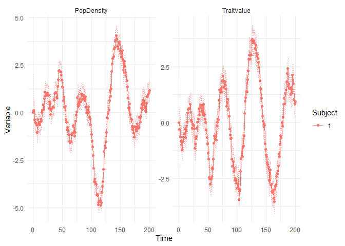
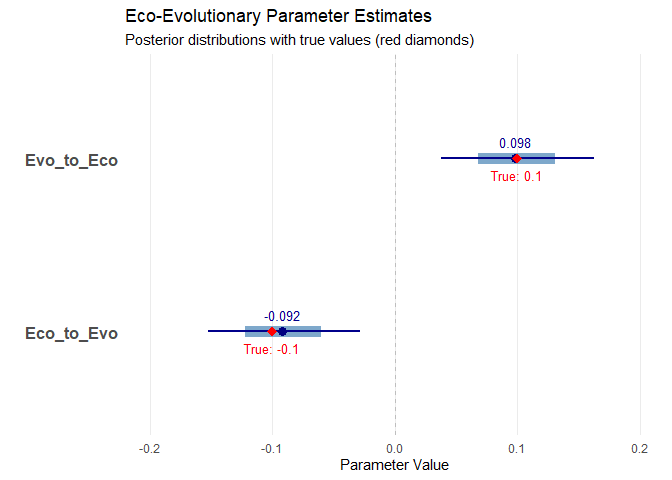

# Method 2. Continuous time method to identifying bidirectional effects
Authors anonymized for peer review.

This example demonstrates how a model specified with ordinary
differential equations can be used to infer bidirectional effects from
simulated data.

We begin by loading in key packages.

``` r
library(ggplot2)
library(ctsem)
library(data.table)
library(tidyr)
```

Here we specify the parameters defining our eco-evolutionary system. Our
aim is for the model we fit to recover these “true” values. In
particular, we are interested in the “Eco_to_Evo” and “Evo_to_Eco”
effects, which capture the bidirectionality in the system. We begin by
setting up the number of time points and observations that we want to
include.

``` r
# Set up time points
times <- seq(from=0, to=200, by=1)
Nobs <- length(times)

# System parameters for perfect oscillations
A_pop <- -0.01         # Modest self-regulation for population 
A_trait <- -0.01      # Modest self-regulation for trait
  
# Exactly balanced cross-effect parameters
Eco_to_Evo <- -0.1    # Effect of population on trait
Evo_to_Eco <- 0.1   # Effect of trait on population (negative feedback)
  
# Equal continuous intercepts
B_pop <- 0
B_trait <- 0

# System noise
G_pop <- 0.2
G_trait <- 0.2
G_cross <- 0.2
```

Here we iteratively generate the data based on our parameters, encoding
key features such as autoregressive effects, bidirectional effects, and
measurement error.

``` r
# Create data frame
data <- data.frame(
  Time = times,
  PopDensity = rep(NA, Nobs),
  TraitValue = rep(NA, Nobs)
)

# Specify initial values
initialPopDensity <- 0
initialTraitValue <- 0 

# Initialize states
PopDensityState <- initialPopDensity
TraitValueState <- initialTraitValue

# Generate data with eco-evolutionary feedback
for(obsi in 1:Nobs) {
  
  # if first observation, just use initial values
  if(obsi == 1) {
    data$PopDensity[obsi] <- PopDensityState
    data$TraitValue[obsi] <- TraitValueState
    
  } else {
    
    # Calculate deterministic changes:
    dPopDensity <- A_pop * PopDensityState + Evo_to_Eco * TraitValueState + B_pop
    dTraitValue <- A_trait * TraitValueState + Eco_to_Evo * PopDensityState + B_trait
      
    # Generate system noise
    systemNoisePopDensity <- rnorm(n=1, mean=0, sd=1)
    systemNoiseTraitValue <- rnorm(n=1, mean=0, sd=1)
    systemNoiseCross <- rnorm(n=1, mean=0, sd=1)
    
    # Update states
    PopDensityState <- PopDensityState + dPopDensity + 
    G_pop * systemNoisePopDensity + G_cross * systemNoiseCross
    
    TraitValueState <- TraitValueState + dTraitValue + 
    G_trait * systemNoiseTraitValue + G_cross * systemNoiseCross
    }
  
  data$PopDensity[obsi] <- PopDensityState
  data$TraitValue[obsi] <- TraitValueState
  
}

# Add minimal measurement error
data$PopDensity <- data$PopDensity + rnorm(n=Nobs, mean=0, sd=0.01)
data$TraitValue <- data$TraitValue + rnorm(n=Nobs, mean=0, sd=0.01)

# Add ID variable for ctsem format
data$ID <- 1
```

Now we specify the model as follows.

``` r
# Specify continuous time model for eco-evolutionary feedback
ct_model <- ctModel(
  # Variable naming
  manifestNames = c("PopDensity", "TraitValue"),  # Observed variables
  latentNames = c("PopDensity", "TraitValue"),    # Latent processes (same as manifest)
  
  # Data structure parameters
  time = "Time",                                  # Time column name
  id = "ID",                                      # ID column name
  type = "stanct",                                # Continuous time model
  
  # Measurement model parameters
  LAMBDA = diag(1, 2),                            # Identity mapping from latent to observed
  MANIFESTMEANS = 0,                              # No measurement intercept
  MANIFESTVAR = c(
    "measError_Pop", 0,                          # Measurement error for population
    0, "measError_Trait"                         # Measurement error for trait
  ),
  
  # Dynamics matrix - key eco-evolutionary parameters
  DRIFT = c(
    "A_pop", "Evo_to_Eco",                       # Population dynamics row
    "Eco_to_Evo", "A_trait"                      # Trait dynamics row
  ),
  
  # Continuous intercepts (baseline rates)
  CINT = c("B_pop", "B_trait"),                  
  
  # Initial state parameters
  T0MEANS = c("init_PopDensity", "init_TraitValue"),
  
  # System noise parameters (stochastic components)
  DIFFUSION = c(
    "G_pop", 0,                                  # Pop noise and upper triangle 0
    "G_cross", "G_trait"                         # Correlation & trait noise
  )
)
```

         [,1]             
    [1,] "init_PopDensity"
    [2,] "init_TraitValue"
         [,1]         [,2]        
    [1,]      "A_pop" "Evo_to_Eco"
    [2,] "Eco_to_Evo"    "A_trait"
         [,1]      [,2]     
    [1,]   "G_pop"       "0"
    [2,] "G_cross" "G_trait"
         [,1]            [,2]             
    [1,] "measError_Pop"               "0"
    [2,]             "0" "measError_Trait"
         [,1]
    [1,]  "0"
    [2,]  "0"
         [,1]     
    [1,]   "B_pop"
    [2,] "B_trait"

Now that the model has been specified, we can fit it to our
observational data:

``` r
# Fit the model to data
ct_fit <- ctStanFit(datalong = data, ctstanmodel = ct_model)
```

Finally, we can assess and visualize the results to see if we recovered
the “true” simulated values. Given our interest in bidirectional
effects, we are primarily concerned with the cross effects “Evo_to_Eco”
and “Eco_to_Evo”. We can also use the ctKalman function below to create
a plot of model expectations relative to the observed data. Here the
plots show “subject 1”, which simply reflects the fact that our
simulation included a single unit of analysis: more specifically, a
single population. See Figure 4 in the main text for an alternate
visualization of the same simulation and fitted model.

``` r
# Summarize results
# summary(ct_fit, parmatrices = FALSE)
ctKalman(ct_fit, plot=TRUE)
```



``` r
# Visualize whether key paramters were recovered

# Create data frame with parameter estimates and true values
params_df <- data.frame(
  Parameter = c("Eco_to_Evo", "Evo_to_Eco"),
  Estimate = c(-0.0919, 0.0984),
  Lower = c(-0.1522, 0.0382),
  Upper = c(-0.0283, 0.1630),
  TrueValue = c(-0.1, 0.1)
)

# Create the plot - horizontal orientation with MCMC style
ggplot(params_df, aes(y = Parameter)) +
  # Add thick line for 50% interval (using mean as proxy since we don't have exact 50% interval)
  geom_segment(aes(x = Lower + (Estimate - Lower)/2, xend = Upper - (Upper - Estimate)/2, 
                  yend = Parameter), size = 4, color = "steelblue", alpha = 0.7) +
  # Add thin line for 95% interval
  geom_segment(aes(x = Lower, xend = Upper, yend = Parameter), size = 1, color = "darkblue") +
  # Add point for posterior mean
  geom_point(aes(x = Estimate), size = 3, color = "navy") +
  # Add points for true values
  geom_point(aes(x = TrueValue), size = 3, color = "red", shape = 18) +
  # Add vertical line at zero
  geom_vline(xintercept = 0, linetype = "dashed", color = "gray") +
  # Add text labels for the means
  geom_text(aes(x = Estimate, label = sprintf("%.3f", Estimate)), 
            vjust = -1, color = "darkblue", size = 3.5) +
  # Add text labels for the true values
  geom_text(aes(x = TrueValue, label = sprintf("True: %.1f", TrueValue)), 
            vjust = 2, color = "red", size = 3.5) +
  # Customize theme for clean MCMC-style plot
  theme_minimal() +
  theme(
    panel.grid.minor = element_blank(),
    panel.grid.major.y = element_blank(),
    axis.text.y = element_text(size = 12, face = "bold")
  ) +
  # Labels
  labs(
    title = "Eco-Evolutionary Parameter Estimates",
    subtitle = "Posterior distributions with true values (red diamonds)",
    x = "Parameter Value",
    y = ""
  ) +
  # Set reasonable x-axis limits
  xlim(-0.2, 0.2)
```


