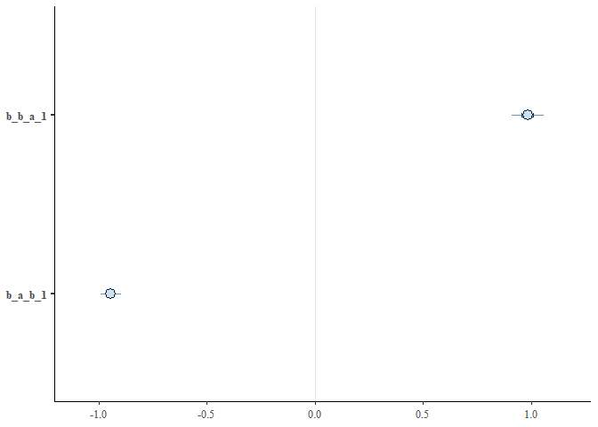
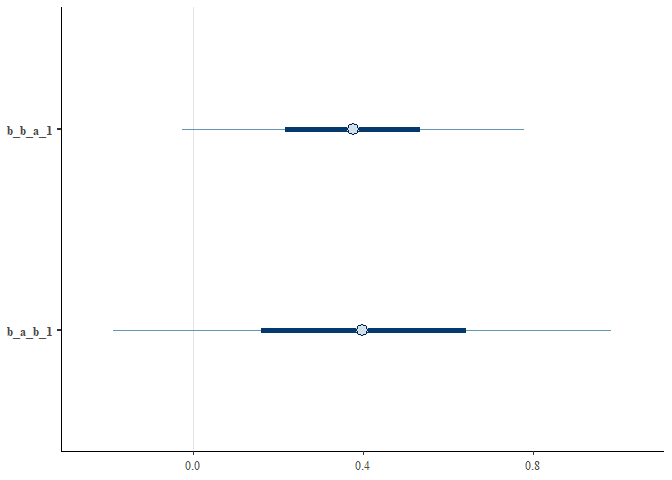
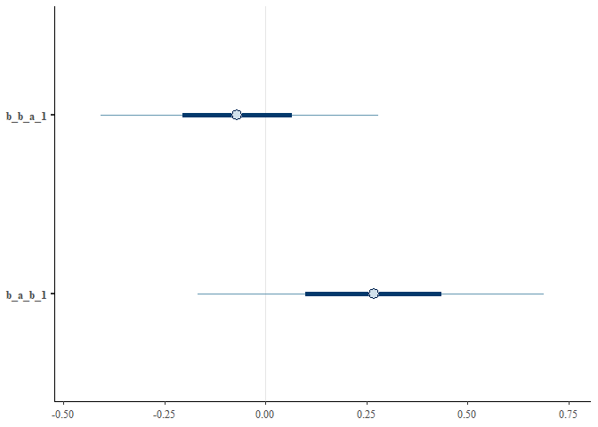
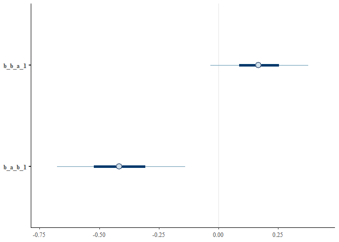
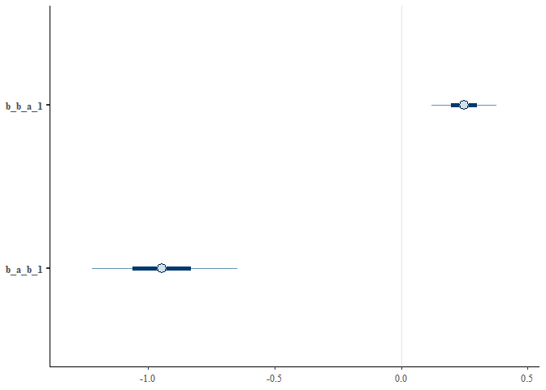

# Method 1. Lagged effects in temporally explicit causal models
Sam Walmsley, Suchinta Arif, Hal Whitehead

This example shows how reciprocal effects between traits can be
extracted from longitudinal datasets. Here we fit a model similar to a
cross-lagged panel model, where two traits are assumed to influence
themselves and one another across successive timesteps.

We begin by loading several key packages:

``` r
library(data.table)
library(ggplot2)
library(dplyr)
library(bayesplot)
library(brms)
library(posterior)
```

``` r
set.seed(12345)
```

## Part 1 - Simple model

First, we will initialize variables for the simulation. These can be
modified to explore how different effect and sample sizes impact the
estimates that the model recovers. Note however that simulated positive
feedbacks can result in massive values which can be tricky to model.

``` r
# Initialize variables
n_time_steps <- 20

# auto effects (dampening)
a_to_a <- 0.25
b_to_b <- 0.25

# cross effects
a_to_b <- 1
b_to_a <- -1

# Create an empty data frame to store the results
df <- data.frame(
  time = integer(),
  a = numeric(),
  b = numeric())
```

Next, we loop over the time steps allowing the variables A and B to
evolve as a function of both auto-regressive and bi-directional effects.
Finally, we create columns containing lagged values of each variable to
facilitate modelling the effects of previous variable values on current
ones.

``` r
# Initialize starting values
a <- numeric(n_time_steps)
b <- numeric(n_time_steps)
a[1] <- 1
b[1] <- 1

# Loop over time steps
for (t in 2:n_time_steps) {

  # A changes as a function of previous values of A (auto) and B (cross) plus random variation
  a[t] <- a_to_a * a[t-1] + b_to_a * b[t-1] + rnorm(1, mean = 0, sd = 0.25)
  
  # A changes as a function of previous values of A (auto) and B (cross) plus random variation
  b[t] <- b_to_b * b[t-1] + a_to_b * a[t-1] + rnorm(1, mean = 0, sd = 0.25)
  
}

# Combine the results into a dataframe
df <- data.frame(
  time = 1:n_time_steps,
  a = a,
  b = b)

# Convert from wide to long format for plotting with ggplot
df_long <- df %>%
  tidyr::pivot_longer(c(a, b), names_to = "trait", values_to = "value")

df <-
  df %>%
  mutate(a_1 = lag(a),
         b_1 = lag(b))
```

Now we are ready to fit the model. First we specify two formulas with A
and B as outcomes, respectively. Each variable is expressed as a
function of itself at a previous timestep, as well as the opposite
variable at a previous timestep.

``` r
library(lavaan)

# Define the cross-lagged model with lagged variables
model <- "
  a ~ a_1 + b_1 
  b ~ b_1 + a_1
"

# Fit the model to your df
fit <- sem(model, data = df)

# Show model summary
summary(fit, fit.measures = TRUE, standardized = TRUE)
```

    lavaan 0.6.16 ended normally after 11 iterations

      Estimator                                         ML
      Optimization method                           NLMINB
      Number of model parameters                         7

                                                      Used       Total
      Number of observations                            19          20

    Model Test User Model:
                                                          
      Test statistic                                 0.000
      Degrees of freedom                                 0

    Model Test Baseline Model:

      Test statistic                               157.432
      Degrees of freedom                                 5
      P-value                                        0.000

    User Model versus Baseline Model:

      Comparative Fit Index (CFI)                    1.000
      Tucker-Lewis Index (TLI)                       1.000

    Loglikelihood and Information Criteria:

      Loglikelihood user model (H0)                  3.451
      Loglikelihood unrestricted model (H1)          3.451
                                                          
      Akaike (AIC)                                   7.097
      Bayesian (BIC)                                13.708
      Sample-size adjusted Bayesian (SABIC)         -7.837

    Root Mean Square Error of Approximation:

      RMSEA                                          0.000
      90 Percent confidence interval - lower         0.000
      90 Percent confidence interval - upper         0.000
      P-value H_0: RMSEA <= 0.050                       NA
      P-value H_0: RMSEA >= 0.080                       NA

    Standardized Root Mean Square Residual:

      SRMR                                           0.000

    Parameter Estimates:

      Standard errors                             Standard
      Information                                 Expected
      Information saturated (h1) model          Structured

    Regressions:
                       Estimate  Std.Err  z-value  P(>|z|)   Std.lv  Std.all
      a ~                                                                   
        a_1               0.276    0.024   11.461    0.000    0.276    0.264
        b_1              -0.945    0.023  -41.436    0.000   -0.945   -0.956
      b ~                                                                   
        b_1               0.306    0.036    8.511    0.000    0.306    0.309
        a_1               0.986    0.038   25.962    0.000    0.986    0.942

    Covariances:
                       Estimate  Std.Err  z-value  P(>|z|)   Std.lv  Std.all
     .a ~~                                                                  
       .b                 0.003    0.011    0.225    0.822    0.003    0.052

    Variances:
                       Estimate  Std.Err  z-value  P(>|z|)   Std.lv  Std.all
       .a                 0.031    0.010    3.082    0.002    0.031    0.010
       .b                 0.077    0.025    3.082    0.002    0.077    0.025

``` r
f1 <- bf(b ~ 0 + Intercept + b_1 + a_1)
f2 <- bf(a ~ 0 + Intercept + a_1 + b_1)

m <-
  brm(data = df,
      family = 'Gaussian',
      f1 + f2 + set_rescor(FALSE),
      prior = c(prior(normal(0, 1), class = b, resp = b, coef = Intercept),
                prior(normal(0, 1), class = b, resp = a, coef = Intercept),
                prior(normal(0, 1), class = b, resp = b),
                prior(normal(0, 1), class = b, resp = a),
                prior(exponential(1), class = sigma, resp = b),
                prior(exponential(1), class = sigma, resp = a)),
      iter = 4000, warmup = 2000, chains = 4, cores = 4)
```

Next, we can examine the fitted model to see if the simulated (“true”)
cross effects between A and B have been recovered.

``` r
summary(m)
```

     Family: MV(gaussian, gaussian) 
      Links: mu = identity; sigma = identity
             mu = identity; sigma = identity 
    Formula: b ~ 0 + Intercept + b_1 + a_1 
             a ~ 0 + Intercept + a_1 + b_1 
       Data: df (Number of observations: 19) 
      Draws: 4 chains, each with iter = 4000; warmup = 2000; thin = 1;
             total post-warmup draws = 8000

    Population-Level Effects: 
                Estimate Est.Error l-95% CI u-95% CI Rhat Bulk_ESS Tail_ESS
    b_Intercept     0.07      0.08    -0.08     0.22 1.00    10839     5544
    b_b_1           0.31      0.04     0.22     0.39 1.00    10074     5280
    b_a_1           0.98      0.05     0.89     1.08 1.00    10912     5387
    a_Intercept     0.03      0.05    -0.06     0.13 1.00    10495     5865
    a_a_1           0.28      0.03     0.22     0.33 1.00    10426     5538
    a_b_1          -0.94      0.03    -1.00    -0.89 1.00     9329     5361

    Family Specific Parameters: 
            Estimate Est.Error l-95% CI u-95% CI Rhat Bulk_ESS Tail_ESS
    sigma_b     0.33      0.06     0.23     0.48 1.00     8358     5286
    sigma_a     0.21      0.04     0.15     0.31 1.00     7988     5534

    Draws were sampled using sampling(NUTS). For each parameter, Bulk_ESS
    and Tail_ESS are effective sample size measures, and Rhat is the potential
    scale reduction factor on split chains (at convergence, Rhat = 1).

``` r
mcmc_intervals(m, pars=c('b_b_a_1','b_a_b_1'))
```



Yes, the model has accurately recovered the causal, bidirectional
effects. Note that “b_b_a_1” refers to the effect of A on B, while
“b_a_b_1” refers to the effect of B on A, which were simulated as 1 and
-1 respectively.

## Part 2 - Incorporating confounds

Next, we consider the incorporation of a simple confound, C, which
influences both focal variables A and B. Here we assume that C is a
time-invariant confound, and that it changes simply as a function of its
own previous values with random noise.

### Example 2.1. Hallucinated cross-lagged effects

For this example, we will simulate a situation in which A and B have no
effects on one another. However, common influence from C, if ignored,
may result in spurious estimates of bidirectional effects.

First, we will initialize variables for the simulation. These can be
modified to explore how different effect and sample sizes impact the
estimates that the model recovers. Note that we have included new
effects for the common-cause confound, “C”.

``` r
# Initialize variables
n_time_steps <- 20

# auto effects (dampening)
a_to_a <- 0.25
b_to_b <- 0.25
c_to_c <- 1

# cross effects
a_to_b <- 0.0
b_to_a <- 0.0

# add in confound
c_to_a <- 1
c_to_b <- 1

# Create an empty data frame to store the results
df <- data.frame(
  time = integer(),
  a = numeric(),
  b = numeric(),
  c = numeric())
```

As before, we simulate the temporal process by which A, B, and C change
in response to one another over each time step. We also need to create
lagged versions of each variable for modelling.

``` r
# Initialize starting values
a <- numeric(n_time_steps)
b <- numeric(n_time_steps)
c <- numeric(n_time_steps)

a[1] <- 1
b[1] <- 1
c[1] <- 1

# Loop over time steps
for (t in 2:n_time_steps) {

  # A changes as a function of previous values of A (auto) and B (cross) plus random variation
  a[t] <- (a_to_a * a[t-1]) + (b_to_a * b[t-1]) + (c_to_a * c[t-1]) + rnorm(1, mean = 0, sd = 0.25)
  
  # A changes as a function of previous values of A (auto) and B (cross) plus random variation
  b[t] <- (b_to_b * b[t-1]) + (a_to_b * a[t-1]) + (c_to_b * c[t-1]) + rnorm(1, mean = 0, sd = 0.25)
  
  # C changes as a function of previous values of C (auto)
  c[t] <- (c_to_c * c[t-1]) + rnorm(1, mean = 0, sd = 0.25)
  
}

# Combine the results into a dataframe
df <- data.frame(
  time = 1:n_time_steps,
  a = a,
  b = b,
  c = c)


# Convert from wide to long format for plotting with ggplot
df_long <- df %>%
  tidyr::pivot_longer(c(a, b), names_to = "trait", values_to = "value")


df <-
  df %>%
  mutate(a_1 = lag(a),
         b_1 = lag(b),
         c_1 = lag(c))
```

First, we attempt a simple model without conditioning on the simulated
confound, C.

``` r
f1 <- bf(b ~ 0 + Intercept + b_1 + a_1)
f2 <- bf(a ~ 0 + Intercept + a_1 + b_1)

m <-
  brm(data = df,
      family = 'Gaussian',
      f1 + f2 + set_rescor(FALSE),
      prior = c(prior(normal(0, 1), class = b, resp = b, coef = Intercept),
                prior(normal(0, 1), class = b, resp = a, coef = Intercept),
                prior(normal(0, 1), class = b, resp = b),
                prior(normal(0, 1), class = b, resp = a),
                prior(exponential(1), class = sigma, resp = b),
                prior(exponential(1), class = sigma, resp = a)),
      iter = 4000, warmup = 2000, chains = 4, cores = 4)
```

As we can see in the model summary, the model does not confidently
identify a lack of bidirectional effects between A and B, despite plenty
of data. In fact, it identifies spurious (non-causal) reciprocal effects
between A and B.

``` r
summary(m)
```

     Family: MV(gaussian, gaussian) 
      Links: mu = identity; sigma = identity
             mu = identity; sigma = identity 
    Formula: b ~ 0 + Intercept + b_1 + a_1 
             a ~ 0 + Intercept + a_1 + b_1 
       Data: df (Number of observations: 19) 
      Draws: 4 chains, each with iter = 4000; warmup = 2000; thin = 1;
             total post-warmup draws = 8000

    Population-Level Effects: 
                Estimate Est.Error l-95% CI u-95% CI Rhat Bulk_ESS Tail_ESS
    b_Intercept     0.42      0.26    -0.11     0.93 1.00     5413     4981
    b_b_1           0.48      0.30    -0.12     1.07 1.00     3698     3646
    b_a_1           0.40      0.26    -0.11     0.92 1.00     4050     4432
    a_Intercept     0.07      0.33    -0.58     0.72 1.00     5147     4574
    a_a_1           0.65      0.32     0.02     1.29 1.00     4062     4494
    a_b_1           0.39      0.37    -0.36     1.11 1.00     3713     4327

    Family Specific Parameters: 
            Estimate Est.Error l-95% CI u-95% CI Rhat Bulk_ESS Tail_ESS
    sigma_b     0.43      0.08     0.30     0.61 1.00     6020     5119
    sigma_a     0.56      0.10     0.40     0.80 1.00     6056     5498

    Draws were sampled using sampling(NUTS). For each parameter, Bulk_ESS
    and Tail_ESS are effective sample size measures, and Rhat is the potential
    scale reduction factor on split chains (at convergence, Rhat = 1).

``` r
mcmc_intervals(m, pars=c('b_b_a_1','b_a_b_1'))
```



Next, we apply a model that conditions on C. By including the effects of
C at t-1 on values of A and B at time t, we are controlling for the
confound and we hope to recover accurate estimates of the (lack!) of
bidirectional effects between A and B.

``` r
summary(m)
```

     Family: MV(gaussian, gaussian) 
      Links: mu = identity; sigma = identity
             mu = identity; sigma = identity 
    Formula: b ~ 0 + Intercept + b_1 + a_1 + c_1 
             a ~ 0 + Intercept + a_1 + b_1 + c_1 
       Data: df (Number of observations: 19) 
      Draws: 4 chains, each with iter = 4000; warmup = 2000; thin = 1;
             total post-warmup draws = 8000

    Population-Level Effects: 
                Estimate Est.Error l-95% CI u-95% CI Rhat Bulk_ESS Tail_ESS
    b_Intercept     0.12      0.19    -0.24     0.49 1.00     5205     4510
    b_b_1           0.40      0.21    -0.03     0.82 1.00     4563     4823
    b_a_1          -0.08      0.21    -0.48     0.34 1.00     4302     4079
    b_c_1           0.87      0.20     0.47     1.24 1.00     6146     4827
    a_Intercept    -0.32      0.24    -0.78     0.16 1.00     5460     5012
    a_a_1           0.05      0.25    -0.45     0.55 1.00     4418     4986
    a_b_1           0.27      0.26    -0.24     0.79 1.00     5348     5054
    a_c_1           1.14      0.24     0.64     1.61 1.00     5922     4565

    Family Specific Parameters: 
            Estimate Est.Error l-95% CI u-95% CI Rhat Bulk_ESS Tail_ESS
    sigma_b     0.28      0.06     0.20     0.41 1.00     5618     5099
    sigma_a     0.36      0.07     0.25     0.52 1.00     5590     5050

    Draws were sampled using sampling(NUTS). For each parameter, Bulk_ESS
    and Tail_ESS are effective sample size measures, and Rhat is the potential
    scale reduction factor on split chains (at convergence, Rhat = 1).

``` r
mcmc_intervals(m, pars=c('b_b_a_1','b_a_b_1'))
```



As expected, the correctly adjusted model recovers the lack of causal
effects between A and B.

### Example 2.2. Innacurate cross-lagged effects

In this example we will consider situations in which non-zero
bidirectional effects are present, but the confound impacts our ability
to estimate them accurately.

First, we will initialize variables for the simulation. These can be
modified to explore how different effect and sample sizes impact the
estimates that the model recovers. Here we simulate strong effects of
the confound C, a weak positive effect of A on B, and a stronger
negative effect of B on A.

``` r
# Initialize variables
n_time_steps <- 20

# auto effects (dampening)
a_to_a <- 0.25
b_to_b <- 0.25
c_to_c <- 1

# cross effects
a_to_b <- 0.25
b_to_a <- -1

# add in confound
c_to_a <- 1
c_to_b <- 1

# Create an empty data frame to store the results
df <- data.frame(
  time = integer(),
  a = numeric(),
  b = numeric(),
  c = numeric())
```

``` r
# Initialize starting values
a <- numeric(n_time_steps)
b <- numeric(n_time_steps)
c <- numeric(n_time_steps)

a[1] <- 1
b[1] <- 1
c[1] <- 1

# Loop over time steps
for (t in 2:n_time_steps) {

  # A changes as a function of previous values of A (auto) and B (cross) plus random variation
  a[t] <- (a_to_a * a[t-1]) + (b_to_a * b[t-1]) + (c_to_a * c[t-1]) + rnorm(1, mean = 0, sd = 0.1)
  
  # A changes as a function of previous values of A (auto) and B (cross) plus random variation
  b[t] <- (b_to_b * b[t-1]) + (a_to_b * a[t-1]) + (c_to_b * c[t-1]) + rnorm(1, mean = 0, sd = 0.1)
  
  # C changes as a function of previous values of C (auto)
  c[t] <- c_to_c*c[t-1] + rnorm(1, mean = 0, sd = 0.1)
  
}

# Combine the results into a dataframe
df <- data.frame(
  time = 1:n_time_steps,
  a = a,
  b = b,
  c = c)

# Convert from wide to long format for plotting with ggplot
df_long <- df %>%
  tidyr::pivot_longer(c(a, b), names_to = "trait", values_to = "value")

df <-
  df %>%
  mutate(a_1 = lag(a),
         b_1 = lag(b),
         c_1 = lag(c))
```

Here we fit a simple model with cross-lagged effects in which we do not
explicitly control for the confound, C.

``` r
f1 <- bf(b ~ 0 + Intercept + b_1 + a_1)
f2 <- bf(a ~ 0 + Intercept + a_1 + b_1)

m <-
  brm(data = df,
      family = 'Gaussian',
      f1 + f2 + set_rescor(FALSE),
      prior = c(prior(normal(0, 1), class = b, resp = b, coef = Intercept),
                prior(normal(0, 1), class = b, resp = a, coef = Intercept),
                prior(normal(0, 1), class = b, resp = b),
                prior(normal(0, 1), class = b, resp = a),
                prior(exponential(1), class = sigma, resp = b),
                prior(exponential(1), class = sigma, resp = a)),
      iter = 4000, warmup = 2000, chains = 4, cores = 4)

summary(m)
```

     Family: MV(gaussian, gaussian) 
      Links: mu = identity; sigma = identity
             mu = identity; sigma = identity 
    Formula: b ~ 0 + Intercept + b_1 + a_1 
             a ~ 0 + Intercept + a_1 + b_1 
       Data: df (Number of observations: 19) 
      Draws: 4 chains, each with iter = 4000; warmup = 2000; thin = 1;
             total post-warmup draws = 8000

    Population-Level Effects: 
                Estimate Est.Error l-95% CI u-95% CI Rhat Bulk_ESS Tail_ESS
    b_Intercept     0.52      0.25     0.02     1.02 1.00     3598     4266
    b_b_1           0.74      0.16     0.43     1.05 1.00     3395     4044
    b_a_1           0.17      0.12    -0.08     0.42 1.00     5089     4626
    a_Intercept     0.40      0.26    -0.14     0.91 1.00     3244     4230
    a_a_1           0.29      0.13     0.03     0.54 1.00     5162     4769
    a_b_1          -0.41      0.16    -0.73    -0.08 1.00     3107     3901

    Family Specific Parameters: 
            Estimate Est.Error l-95% CI u-95% CI Rhat Bulk_ESS Tail_ESS
    sigma_b     0.20      0.04     0.14     0.29 1.00     5759     5148
    sigma_a     0.21      0.04     0.15     0.31 1.00     5979     4673

    Draws were sampled using sampling(NUTS). For each parameter, Bulk_ESS
    and Tail_ESS are effective sample size measures, and Rhat is the potential
    scale reduction factor on split chains (at convergence, Rhat = 1).

``` r
summary(m)
```

     Family: MV(gaussian, gaussian) 
      Links: mu = identity; sigma = identity
             mu = identity; sigma = identity 
    Formula: b ~ 0 + Intercept + b_1 + a_1 
             a ~ 0 + Intercept + a_1 + b_1 
       Data: df (Number of observations: 19) 
      Draws: 4 chains, each with iter = 4000; warmup = 2000; thin = 1;
             total post-warmup draws = 8000

    Population-Level Effects: 
                Estimate Est.Error l-95% CI u-95% CI Rhat Bulk_ESS Tail_ESS
    b_Intercept     0.52      0.25     0.02     1.02 1.00     3598     4266
    b_b_1           0.74      0.16     0.43     1.05 1.00     3395     4044
    b_a_1           0.17      0.12    -0.08     0.42 1.00     5089     4626
    a_Intercept     0.40      0.26    -0.14     0.91 1.00     3244     4230
    a_a_1           0.29      0.13     0.03     0.54 1.00     5162     4769
    a_b_1          -0.41      0.16    -0.73    -0.08 1.00     3107     3901

    Family Specific Parameters: 
            Estimate Est.Error l-95% CI u-95% CI Rhat Bulk_ESS Tail_ESS
    sigma_b     0.20      0.04     0.14     0.29 1.00     5759     5148
    sigma_a     0.21      0.04     0.15     0.31 1.00     5979     4673

    Draws were sampled using sampling(NUTS). For each parameter, Bulk_ESS
    and Tail_ESS are effective sample size measures, and Rhat is the potential
    scale reduction factor on split chains (at convergence, Rhat = 1).

``` r
mcmc_intervals(m, pars=c('b_b_a_1','b_a_b_1'))
```



As we can see in the above model summary, we do not recover the
simulated effects of A on B (0.25) or B on A (-1) accurately. The
effects are roughly similar in direction and magnitude however,
suggesting that the model is still picking up some of what we simulated,
even with confounding. Of course the extent to which this is true will
depend on the causal scenario and effect size at hand.

Next, we fit the more causally appropriate model in which we condition
on the known confound.

``` r
f1 <- bf(b ~ 0 + Intercept + b_1 + a_1 + c_1)
f2 <- bf(a ~ 0 + Intercept + a_1 + b_1 + c_1)

m <-
  brm(data = df,
      family = 'Gaussian',
      f1 + f2 + set_rescor(FALSE),
      prior = c(prior(normal(0, 1), class = b, resp = b, coef = Intercept),
                prior(normal(0, 1), class = b, resp = a, coef = Intercept),
                prior(normal(0, 1), class = b, resp = b),
                prior(normal(0, 1), class = b, resp = a),
                prior(exponential(1), class = sigma, resp = b),
                prior(exponential(1), class = sigma, resp = a)),
      iter = 4000, warmup = 2000, chains = 4, cores = 4)

summary(m)
```

     Family: MV(gaussian, gaussian) 
      Links: mu = identity; sigma = identity
             mu = identity; sigma = identity 
    Formula: b ~ 0 + Intercept + b_1 + a_1 + c_1 
             a ~ 0 + Intercept + a_1 + b_1 + c_1 
       Data: df (Number of observations: 19) 
      Draws: 4 chains, each with iter = 4000; warmup = 2000; thin = 1;
             total post-warmup draws = 8000

    Population-Level Effects: 
                Estimate Est.Error l-95% CI u-95% CI Rhat Bulk_ESS Tail_ESS
    b_Intercept    -0.01      0.19    -0.38     0.36 1.00     4676     4502
    b_b_1           0.16      0.15    -0.12     0.45 1.00     4450     4697
    b_a_1           0.25      0.07     0.10     0.39 1.00     5710     5337
    b_c_1           1.09      0.21     0.67     1.51 1.00     3719     3860
    a_Intercept    -0.07      0.21    -0.48     0.36 1.00     5383     4595
    a_a_1           0.36      0.09     0.19     0.54 1.00     5904     4855
    a_b_1          -0.95      0.17    -1.28    -0.61 1.00     3777     3699
    a_c_1           1.01      0.24     0.52     1.45 1.00     3681     3463

    Family Specific Parameters: 
            Estimate Est.Error l-95% CI u-95% CI Rhat Bulk_ESS Tail_ESS
    sigma_b     0.12      0.02     0.08     0.17 1.00     5631     5054
    sigma_a     0.14      0.03     0.10     0.20 1.00     5095     4110

    Draws were sampled using sampling(NUTS). For each parameter, Bulk_ESS
    and Tail_ESS are effective sample size measures, and Rhat is the potential
    scale reduction factor on split chains (at convergence, Rhat = 1).

``` r
summary(m)
```

     Family: MV(gaussian, gaussian) 
      Links: mu = identity; sigma = identity
             mu = identity; sigma = identity 
    Formula: b ~ 0 + Intercept + b_1 + a_1 + c_1 
             a ~ 0 + Intercept + a_1 + b_1 + c_1 
       Data: df (Number of observations: 19) 
      Draws: 4 chains, each with iter = 4000; warmup = 2000; thin = 1;
             total post-warmup draws = 8000

    Population-Level Effects: 
                Estimate Est.Error l-95% CI u-95% CI Rhat Bulk_ESS Tail_ESS
    b_Intercept    -0.01      0.19    -0.38     0.36 1.00     4676     4502
    b_b_1           0.16      0.15    -0.12     0.45 1.00     4450     4697
    b_a_1           0.25      0.07     0.10     0.39 1.00     5710     5337
    b_c_1           1.09      0.21     0.67     1.51 1.00     3719     3860
    a_Intercept    -0.07      0.21    -0.48     0.36 1.00     5383     4595
    a_a_1           0.36      0.09     0.19     0.54 1.00     5904     4855
    a_b_1          -0.95      0.17    -1.28    -0.61 1.00     3777     3699
    a_c_1           1.01      0.24     0.52     1.45 1.00     3681     3463

    Family Specific Parameters: 
            Estimate Est.Error l-95% CI u-95% CI Rhat Bulk_ESS Tail_ESS
    sigma_b     0.12      0.02     0.08     0.17 1.00     5631     5054
    sigma_a     0.14      0.03     0.10     0.20 1.00     5095     4110

    Draws were sampled using sampling(NUTS). For each parameter, Bulk_ESS
    and Tail_ESS are effective sample size measures, and Rhat is the potential
    scale reduction factor on split chains (at convergence, Rhat = 1).

``` r
mcmc_intervals(m, pars=c('b_b_a_1','b_a_b_1'))
```



Here, as expected, we recover more accurate estimates of the direct
effects of A on B and of B on A.

## Sum-up

Here we have shown that temporally-explicit causal models with lag terms
can accurately recover bidirectional effects. However, this model
structure is not immune to the more general challenges of causal
inference. Specifically, we show that it may be necessary to consider
other causal pathologies (e.g.,confounding) in order to generate
accurate causal inferences.
