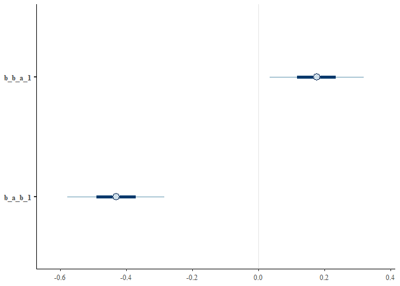

# Method 1. Lagged effects in temporally explicit causal models
Sam Walmsley, Suchinta Arif, Hal Whitehead

This example shows how reciprocal effects between traits can be
extracted from longitudinal datasets. Here we fit a model similar to a
cross-lagged panel model, where two traits are assumed to influence
themselves and one another across successive timesteps.

We begin by loading several key packages:

``` r
library(data.table)
library(ggplot2)
library(dplyr)
library(bayesplot)
library(brms)
library(posterior)
```

## Part 1 - Simple model

First, we will initialize variables for the simulation. These can be
modified to explore how different effect and sample sizes impact the
estimates that the model recovers. Note however that simulated positive
feedbacks can result in massive values which can be tricky to model.

``` r
# Initialize variables
n_time_steps <- 50

# auto effects (dampening)
a_to_a <- 0.25
b_to_b <- 0.25

# cross effects
a_to_b <- 1
b_to_a <- -1

# Create an empty data frame to store the results
df <- data.frame(
  time = integer(),
  a = numeric(),
  b = numeric())
```

Next, we loop over the time steps allowing the variables A and B to
evolve as a function of both auto-regressive and bi-directional effects.
Finally, we create columns containing lagged values of each variable to
facilitate modelling the effects of previous variable values on current
ones.

``` r
# Initialize starting values
a <- numeric(n_time_steps)
b <- numeric(n_time_steps)
a[1] <- 1
b[1] <- 1

# Loop over time steps
for (t in 2:n_time_steps) {

  # A changes as a function of previous values of A (auto) and B (cross) plus random variation
  a[t] <- a_to_a * a[t-1] + b_to_a * b[t-1] + rnorm(1, mean = 0, sd = 0.25)
  
  # A changes as a function of previous values of A (auto) and B (cross) plus random variation
  b[t] <- b_to_b * b[t-1] + a_to_b * a[t-1] + rnorm(1, mean = 0, sd = 0.25)
  
}

# Combine the results into a dataframe
df <- data.frame(
  time = 1:n_time_steps,
  a = a,
  b = b)

# Convert from wide to long format for plotting with ggplot
df_long <- df %>%
  tidyr::pivot_longer(c(a, b), names_to = "trait", values_to = "value")

df <-
  df %>%
  mutate(a_1 = lag(a),
         b_1 = lag(b))
```

Now we are ready to fit the model. First we specify two formulas with A
and B as outcomes, respectively. Each variable is expressed as a
function of itself at a previous timestep, as well as the opposite
variable at a previous timestep.

``` r
f1 <- bf(b ~ 0 + Intercept + b_1 + a_1)
f2 <- bf(a ~ 0 + Intercept + a_1 + b_1)

m <-
  brm(data = df,
      family = 'Gaussian',
      f1 + f2 + set_rescor(FALSE),
      prior = c(prior(normal(0, 1), class = b, resp = b, coef = Intercept),
                prior(normal(0, 1), class = b, resp = a, coef = Intercept),
                prior(normal(0, 1), class = b, resp = b),
                prior(normal(0, 1), class = b, resp = a),
                prior(exponential(1), class = sigma, resp = b),
                prior(exponential(1), class = sigma, resp = a)),
      iter = 4000, warmup = 2000, chains = 4, cores = 4)
```

Next, we can examine the fitted model to see if the simulated (“true”)
cross effects between A and B have been recovered.

``` r
summary(m)
```

     Family: MV(gaussian, gaussian) 
      Links: mu = identity; sigma = identity
             mu = identity; sigma = identity 
    Formula: b ~ 0 + Intercept + b_1 + a_1 
             a ~ 0 + Intercept + a_1 + b_1 
       Data: df (Number of observations: 49) 
      Draws: 4 chains, each with iter = 4000; warmup = 2000; thin = 1;
             total post-warmup draws = 8000

    Population-Level Effects: 
                Estimate Est.Error l-95% CI u-95% CI Rhat Bulk_ESS Tail_ESS
    b_Intercept     0.01      0.04    -0.08     0.09 1.00    11976     6281
    b_b_1           0.24      0.02     0.19     0.28 1.00    13481     5515
    b_a_1           0.98      0.02     0.94     1.03 1.00    14616     6174
    a_Intercept     0.03      0.04    -0.05     0.10 1.00    14064     6167
    a_a_1           0.26      0.02     0.22     0.30 1.00    12758     5521
    a_b_1          -0.98      0.02    -1.02    -0.94 1.00    12750     6349

    Family Specific Parameters: 
            Estimate Est.Error l-95% CI u-95% CI Rhat Bulk_ESS Tail_ESS
    sigma_b     0.30      0.03     0.24     0.37 1.00    11212     6137
    sigma_a     0.26      0.03     0.21     0.32 1.00    11297     6337

    Draws were sampled using sampling(NUTS). For each parameter, Bulk_ESS
    and Tail_ESS are effective sample size measures, and Rhat is the potential
    scale reduction factor on split chains (at convergence, Rhat = 1).

``` r
mcmc_intervals(m, pars=c('b_b_a_1','b_a_b_1'))
```


Yes, the model has accurately recovered the causal, bidirectional
effects. Note that “b_b_a_1” refers to the effect of A on B, while
“b_a_b_1” refers to the effect of B on A, which were simulated as 1 and
-1 respectively.

## Part 2 - Incorporating confounds

Next, we consider the incorporation of a simple confound, C, which
influences both focal variables A and B. Here we assume that C is a
time-invariant confound, and that it changes simply as a function of its
own previous values with random noise.

### Example 2.1. Hallucinated cross-lagged effects

For this example, we will simulate a situation in which A and B have no
effects on one another. However, common influence from C, if ignored,
may result in spurious estimates of bidirectional effects.

First, we will initialize variables for the simulation. These can be
modified to explore how different effect and sample sizes impact the
estimates that the model recovers. Note that we have included new
effects for the common-cause confound, “C”.

``` r
# Initialize variables
n_time_steps <- 50

# auto effects (dampening)
a_to_a <- 0.25
b_to_b <- 0.25
c_to_c <- 1

# cross effects
a_to_b <- 0.0
b_to_a <- 0.0

# add in confound
c_to_a <- 1
c_to_b <- 1

# Create an empty data frame to store the results
df <- data.frame(
  time = integer(),
  a = numeric(),
  b = numeric(),
  c = numeric())
```

As before, we simulate the temporal process by which A, B, and C change
in response to one another over each time step. We also need to create
lagged versions of each variable for modelling.

``` r
# Initialize starting values
a <- numeric(n_time_steps)
b <- numeric(n_time_steps)
c <- numeric(n_time_steps)

a[1] <- 1
b[1] <- 1
c[1] <- 1

# Loop over time steps
for (t in 2:n_time_steps) {

  # A changes as a function of previous values of A (auto) and B (cross) plus random variation
  a[t] <- (a_to_a * a[t-1]) + (b_to_a * b[t-1]) + (c_to_a * c[t-1]) + rnorm(1, mean = 0, sd = 0.25)
  
  # A changes as a function of previous values of A (auto) and B (cross) plus random variation
  b[t] <- (b_to_b * b[t-1]) + (a_to_b * a[t-1]) + (c_to_b * c[t-1]) + rnorm(1, mean = 0, sd = 0.25)
  
  # C changes as a function of previous values of C (auto)
  c[t] <- (c_to_c * c[t-1]) + rnorm(1, mean = 0, sd = 0.25)
  
}

# Combine the results into a dataframe
df <- data.frame(
  time = 1:n_time_steps,
  a = a,
  b = b,
  c = c)


# Convert from wide to long format for plotting with ggplot
df_long <- df %>%
  tidyr::pivot_longer(c(a, b), names_to = "trait", values_to = "value")


df <-
  df %>%
  mutate(a_1 = lag(a),
         b_1 = lag(b),
         c_1 = lag(c))
```

First, we attempt a simple model without conditioning on the simulated
confound, C.

``` r
f1 <- bf(b ~ 0 + Intercept + b_1 + a_1)
f2 <- bf(a ~ 0 + Intercept + a_1 + b_1)

m <-
  brm(data = df,
      family = 'Gaussian',
      f1 + f2 + set_rescor(FALSE),
      prior = c(prior(normal(0, 1), class = b, resp = b, coef = Intercept),
                prior(normal(0, 1), class = b, resp = a, coef = Intercept),
                prior(normal(0, 1), class = b, resp = b),
                prior(normal(0, 1), class = b, resp = a),
                prior(exponential(1), class = sigma, resp = b),
                prior(exponential(1), class = sigma, resp = a)),
      iter = 4000, warmup = 2000, chains = 4, cores = 4)
```

As we can see in the model summary, the model does not confidently
identify a lack of bidirectional effects between A and B, despite plenty
of data. In fact, it identifies spurious (non-causal) reciprocal effects
between A and B.

``` r
summary(m)
```

     Family: MV(gaussian, gaussian) 
      Links: mu = identity; sigma = identity
             mu = identity; sigma = identity 
    Formula: b ~ 0 + Intercept + b_1 + a_1 
             a ~ 0 + Intercept + a_1 + b_1 
       Data: df (Number of observations: 49) 
      Draws: 4 chains, each with iter = 4000; warmup = 2000; thin = 1;
             total post-warmup draws = 8000

    Population-Level Effects: 
                Estimate Est.Error l-95% CI u-95% CI Rhat Bulk_ESS Tail_ESS
    b_Intercept    -0.04      0.06    -0.16     0.07 1.00     9063     5778
    b_b_1           0.64      0.15     0.35     0.93 1.00     5450     5096
    b_a_1           0.37      0.16     0.06     0.68 1.00     5410     5099
    a_Intercept     0.02      0.07    -0.11     0.15 1.00     9597     5491
    a_a_1           0.46      0.18     0.10     0.82 1.00     5691     5185
    a_b_1           0.47      0.17     0.13     0.81 1.00     5782     5097

    Family Specific Parameters: 
            Estimate Est.Error l-95% CI u-95% CI Rhat Bulk_ESS Tail_ESS
    sigma_b     0.35      0.04     0.28     0.43 1.00     9396     5758
    sigma_a     0.39      0.04     0.32     0.48 1.00     8212     5831

    Draws were sampled using sampling(NUTS). For each parameter, Bulk_ESS
    and Tail_ESS are effective sample size measures, and Rhat is the potential
    scale reduction factor on split chains (at convergence, Rhat = 1).

``` r
mcmc_intervals(m, pars=c('b_b_a_1','b_a_b_1'))
```


Next, we apply a model that conditions on C. By including the effects of
C at t-1 on values of A and B at time t, we are controlling for the
confound and we hope to recover accurate estimates of the (lack!) of
bidirectional effects between A and B.

``` r
summary(m)
```

     Family: MV(gaussian, gaussian) 
      Links: mu = identity; sigma = identity
             mu = identity; sigma = identity 
    Formula: b ~ 0 + Intercept + b_1 + a_1 + c_1 
             a ~ 0 + Intercept + a_1 + b_1 + c_1 
       Data: df (Number of observations: 49) 
      Draws: 4 chains, each with iter = 4000; warmup = 2000; thin = 1;
             total post-warmup draws = 8000

    Population-Level Effects: 
                Estimate Est.Error l-95% CI u-95% CI Rhat Bulk_ESS Tail_ESS
    b_Intercept    -0.04      0.04    -0.11     0.03 1.00     8426     5859
    b_b_1           0.18      0.11    -0.04     0.40 1.00     5403     5139
    b_a_1           0.10      0.11    -0.12     0.31 1.00     5855     5673
    b_c_1           1.04      0.13     0.79     1.29 1.00     6144     4963
    a_Intercept     0.02      0.05    -0.07     0.11 1.00     9367     5962
    a_a_1           0.20      0.14    -0.08     0.48 1.00     6293     5194
    a_b_1           0.01      0.15    -0.28     0.30 1.00     5233     5452
    a_c_1           1.02      0.16     0.70     1.34 1.00     6909     5626

    Family Specific Parameters: 
            Estimate Est.Error l-95% CI u-95% CI Rhat Bulk_ESS Tail_ESS
    sigma_b     0.22      0.02     0.18     0.27 1.00     7741     5797
    sigma_a     0.29      0.03     0.23     0.35 1.00     8360     5797

    Draws were sampled using sampling(NUTS). For each parameter, Bulk_ESS
    and Tail_ESS are effective sample size measures, and Rhat is the potential
    scale reduction factor on split chains (at convergence, Rhat = 1).

``` r
mcmc_intervals(m, pars=c('b_b_a_1','b_a_b_1'))
```


As expected, the correctly adjusted model recovers the lack of causal
effects between A and B.

### Example 2.2. Innacurate cross-lagged effects

In this example we will consider situations in which non-zero
bidirectional effects are present, but the confound impacts our ability
to estimate them accurately.

First, we will initialize variables for the simulation. These can be
modified to explore how different effect and sample sizes impact the
estimates that the model recovers. Here we simulate strong effects of
the confound C, a weak positive effect of A on B, and a stronger
negative effect of B on A.

``` r
# Initialize variables
n_time_steps <- 50

# auto effects (dampening)
a_to_a <- 0.25
b_to_b <- 0.25
c_to_c <- 1

# cross effects
a_to_b <- 0.25
b_to_a <- -1

# add in confound
c_to_a <- 1
c_to_b <- 1

# Create an empty data frame to store the results
df <- data.frame(
  time = integer(),
  a = numeric(),
  b = numeric(),
  c = numeric())
```

``` r
# Initialize starting values
a <- numeric(n_time_steps)
b <- numeric(n_time_steps)
c <- numeric(n_time_steps)

a[1] <- 1
b[1] <- 1
c[1] <- 1

# Loop over time steps
for (t in 2:n_time_steps) {

  # A changes as a function of previous values of A (auto) and B (cross) plus random variation
  a[t] <- (a_to_a * a[t-1]) + (b_to_a * b[t-1]) + (c_to_a * c[t-1]) + rnorm(1, mean = 0, sd = 0.1)
  
  # A changes as a function of previous values of A (auto) and B (cross) plus random variation
  b[t] <- (b_to_b * b[t-1]) + (a_to_b * a[t-1]) + (c_to_b * c[t-1]) + rnorm(1, mean = 0, sd = 0.1)
  
  # C changes as a function of previous values of C (auto)
  c[t] <- c_to_c*c[t-1] + rnorm(1, mean = 0, sd = 0.1)
  
}

# Combine the results into a dataframe
df <- data.frame(
  time = 1:n_time_steps,
  a = a,
  b = b,
  c = c)

# Convert from wide to long format for plotting with ggplot
df_long <- df %>%
  tidyr::pivot_longer(c(a, b), names_to = "trait", values_to = "value")

df <-
  df %>%
  mutate(a_1 = lag(a),
         b_1 = lag(b),
         c_1 = lag(c))
```

Here we fit a simple model with cross-lagged effects in which we do not
explicitly control for the confound, C.

``` r
f1 <- bf(b ~ 0 + Intercept + b_1 + a_1)
f2 <- bf(a ~ 0 + Intercept + a_1 + b_1)

m <-
  brm(data = df,
      family = 'Gaussian',
      f1 + f2 + set_rescor(FALSE),
      prior = c(prior(normal(0, 1), class = b, resp = b, coef = Intercept),
                prior(normal(0, 1), class = b, resp = a, coef = Intercept),
                prior(normal(0, 1), class = b, resp = b),
                prior(normal(0, 1), class = b, resp = a),
                prior(exponential(1), class = sigma, resp = b),
                prior(exponential(1), class = sigma, resp = a)),
      iter = 4000, warmup = 2000, chains = 4, cores = 4)

summary(m)
```

     Family: MV(gaussian, gaussian) 
      Links: mu = identity; sigma = identity
             mu = identity; sigma = identity 
    Formula: b ~ 0 + Intercept + b_1 + a_1 
             a ~ 0 + Intercept + a_1 + b_1 
       Data: df (Number of observations: 49) 
      Draws: 4 chains, each with iter = 4000; warmup = 2000; thin = 1;
             total post-warmup draws = 8000

    Population-Level Effects: 
                Estimate Est.Error l-95% CI u-95% CI Rhat Bulk_ESS Tail_ESS
    b_Intercept     0.56      0.14     0.28     0.85 1.00     4165     4735
    b_b_1           0.68      0.10     0.49     0.87 1.00     4027     4570
    b_a_1           0.30      0.09     0.13     0.46 1.00     6576     5662
    a_Intercept     0.32      0.15     0.04     0.60 1.00     3949     4683
    a_a_1           0.19      0.09     0.01     0.36 1.00     7101     5151
    a_b_1          -0.40      0.10    -0.60    -0.21 1.00     3941     4295

    Family Specific Parameters: 
            Estimate Est.Error l-95% CI u-95% CI Rhat Bulk_ESS Tail_ESS
    sigma_b     0.16      0.02     0.13     0.19 1.00     6682     5421
    sigma_a     0.16      0.02     0.13     0.20 1.00     6856     5271

    Draws were sampled using sampling(NUTS). For each parameter, Bulk_ESS
    and Tail_ESS are effective sample size measures, and Rhat is the potential
    scale reduction factor on split chains (at convergence, Rhat = 1).

``` r
summary(m)
```

     Family: MV(gaussian, gaussian) 
      Links: mu = identity; sigma = identity
             mu = identity; sigma = identity 
    Formula: b ~ 0 + Intercept + b_1 + a_1 
             a ~ 0 + Intercept + a_1 + b_1 
       Data: df (Number of observations: 49) 
      Draws: 4 chains, each with iter = 4000; warmup = 2000; thin = 1;
             total post-warmup draws = 8000

    Population-Level Effects: 
                Estimate Est.Error l-95% CI u-95% CI Rhat Bulk_ESS Tail_ESS
    b_Intercept     0.56      0.14     0.28     0.85 1.00     4165     4735
    b_b_1           0.68      0.10     0.49     0.87 1.00     4027     4570
    b_a_1           0.30      0.09     0.13     0.46 1.00     6576     5662
    a_Intercept     0.32      0.15     0.04     0.60 1.00     3949     4683
    a_a_1           0.19      0.09     0.01     0.36 1.00     7101     5151
    a_b_1          -0.40      0.10    -0.60    -0.21 1.00     3941     4295

    Family Specific Parameters: 
            Estimate Est.Error l-95% CI u-95% CI Rhat Bulk_ESS Tail_ESS
    sigma_b     0.16      0.02     0.13     0.19 1.00     6682     5421
    sigma_a     0.16      0.02     0.13     0.20 1.00     6856     5271

    Draws were sampled using sampling(NUTS). For each parameter, Bulk_ESS
    and Tail_ESS are effective sample size measures, and Rhat is the potential
    scale reduction factor on split chains (at convergence, Rhat = 1).

``` r
mcmc_intervals(m, pars=c('b_b_a_1','b_a_b_1'))
```



As we can see in the above model summary, we do not recover the
simulated effects of A on B (0.1) or B on A (-1) accurately. The effects
are roughly similar in direction and magnitude however, suggesting that
the model is still picking up some of what we simulated, even with
confounding. Of course the extent to which this is true will depend on
the causal scenario and effect size at hand.

Next, we fit the more causally appropriate model in which we condition
on the known confound.

``` r
f1 <- bf(b ~ 0 + Intercept + b_1 + a_1 + c_1)
f2 <- bf(a ~ 0 + Intercept + a_1 + b_1 + c_1)

m <-
  brm(data = df,
      family = 'Gaussian',
      f1 + f2 + set_rescor(FALSE),
      prior = c(prior(normal(0, 1), class = b, resp = b, coef = Intercept),
                prior(normal(0, 1), class = b, resp = a, coef = Intercept),
                prior(normal(0, 1), class = b, resp = b),
                prior(normal(0, 1), class = b, resp = a),
                prior(exponential(1), class = sigma, resp = b),
                prior(exponential(1), class = sigma, resp = a)),
      iter = 4000, warmup = 2000, chains = 4, cores = 4)

summary(m)
```

     Family: MV(gaussian, gaussian) 
      Links: mu = identity; sigma = identity
             mu = identity; sigma = identity 
    Formula: b ~ 0 + Intercept + b_1 + a_1 + c_1 
             a ~ 0 + Intercept + a_1 + b_1 + c_1 
       Data: df (Number of observations: 49) 
      Draws: 4 chains, each with iter = 4000; warmup = 2000; thin = 1;
             total post-warmup draws = 8000

    Population-Level Effects: 
                Estimate Est.Error l-95% CI u-95% CI Rhat Bulk_ESS Tail_ESS
    b_Intercept     0.04      0.10    -0.15     0.23 1.00     6341     5697
    b_b_1           0.21      0.07     0.06     0.35 1.00     5812     4873
    b_a_1           0.31      0.05     0.22     0.41 1.00     7395     5148
    b_c_1           1.02      0.11     0.81     1.23 1.00     4754     4870
    a_Intercept    -0.14      0.12    -0.37     0.09 1.00     7086     6144
    a_a_1           0.20      0.06     0.08     0.31 1.00     8748     5891
    a_b_1          -0.85      0.09    -1.02    -0.67 1.00     6076     4917
    a_c_1           0.94      0.13     0.69     1.19 1.00     5286     5363

    Family Specific Parameters: 
            Estimate Est.Error l-95% CI u-95% CI Rhat Bulk_ESS Tail_ESS
    sigma_b     0.09      0.01     0.07     0.11 1.00     7860     6226
    sigma_a     0.11      0.01     0.09     0.13 1.00     7884     5739

    Draws were sampled using sampling(NUTS). For each parameter, Bulk_ESS
    and Tail_ESS are effective sample size measures, and Rhat is the potential
    scale reduction factor on split chains (at convergence, Rhat = 1).

``` r
summary(m)
```

     Family: MV(gaussian, gaussian) 
      Links: mu = identity; sigma = identity
             mu = identity; sigma = identity 
    Formula: b ~ 0 + Intercept + b_1 + a_1 + c_1 
             a ~ 0 + Intercept + a_1 + b_1 + c_1 
       Data: df (Number of observations: 49) 
      Draws: 4 chains, each with iter = 4000; warmup = 2000; thin = 1;
             total post-warmup draws = 8000

    Population-Level Effects: 
                Estimate Est.Error l-95% CI u-95% CI Rhat Bulk_ESS Tail_ESS
    b_Intercept     0.04      0.10    -0.15     0.23 1.00     6341     5697
    b_b_1           0.21      0.07     0.06     0.35 1.00     5812     4873
    b_a_1           0.31      0.05     0.22     0.41 1.00     7395     5148
    b_c_1           1.02      0.11     0.81     1.23 1.00     4754     4870
    a_Intercept    -0.14      0.12    -0.37     0.09 1.00     7086     6144
    a_a_1           0.20      0.06     0.08     0.31 1.00     8748     5891
    a_b_1          -0.85      0.09    -1.02    -0.67 1.00     6076     4917
    a_c_1           0.94      0.13     0.69     1.19 1.00     5286     5363

    Family Specific Parameters: 
            Estimate Est.Error l-95% CI u-95% CI Rhat Bulk_ESS Tail_ESS
    sigma_b     0.09      0.01     0.07     0.11 1.00     7860     6226
    sigma_a     0.11      0.01     0.09     0.13 1.00     7884     5739

    Draws were sampled using sampling(NUTS). For each parameter, Bulk_ESS
    and Tail_ESS are effective sample size measures, and Rhat is the potential
    scale reduction factor on split chains (at convergence, Rhat = 1).

``` r
mcmc_intervals(m, pars=c('b_b_a_1','b_a_b_1'))
```


Here, as expected, we recover more accurate estimates of the direct
effects of A on B and of B on A.

## Sum-up

Here we have shown that temporally-explicit causal models with lag terms
can accurately recover bidirectional effects. However, this model
structure is not immune to the more general challenges of causal
inference. Specifically, we show that it may be necessary to consider
other causal pathologies (e.g.,confounding) in order to generate
accurate causal inferences.
