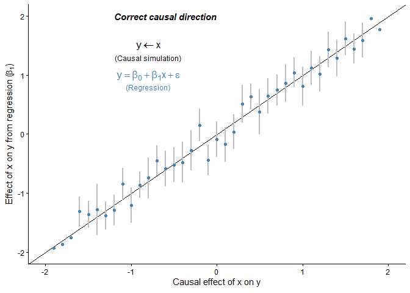
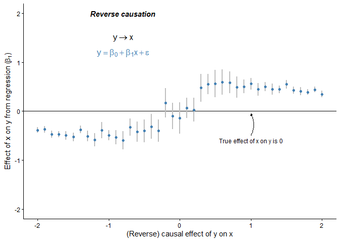
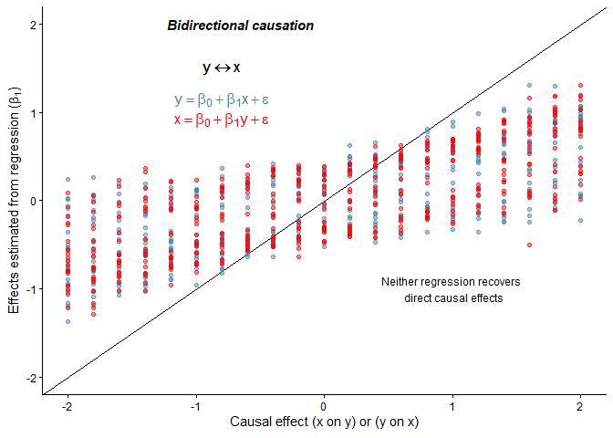
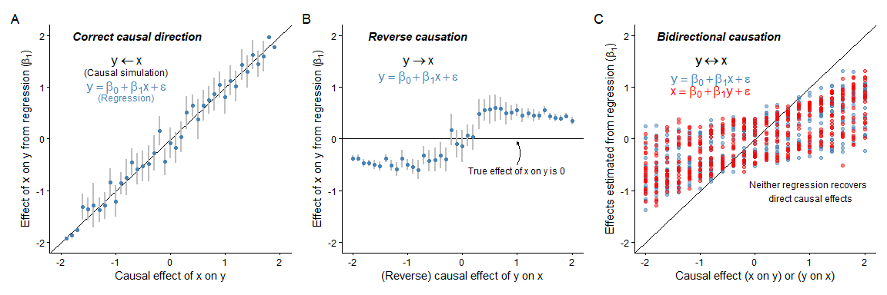

# Example for Figure 2. Reverse causation in simple regression models
Sam Walmsley, Suchinta Arif, Hal Whitehead

# Bidirectional effects and causal inference from simple regression

This example shows how simple regression will not necessarily recover a
causal effect between two variables depending on the underlying causal
effects, as shown in Figure 2 in the main text.

We begin by loading several key packages:

``` r
library(data.table)
library(ggplot2)
library(patchwork)
```

``` r
set.seed(12345)
my_cols <- c('steelblue','red')
```

## Panel 1 - “Correct” regression for causal structure: x causes y

Across a range of effect sizes, we simulate two variables, x and y,
where x is a direct cause of y. We then fit a regression of y on x, and
save the key parameters so we can visualize whether the regression
coefficient matches the true causal effect.

``` r
# Simulation function
regression_sim_x_to_y <- function() {
  
  n <- 50
  beta <- seq(-2,2,by=0.1)
  output <- data.table(index=(1:length(beta)))
  
  for (i in 1:length(beta)){
    
    x <- rnorm(n,0,1) # simulate x values
    y <- beta[i]*x + rnorm(n) # simulate y values
    
    m <- lm(y ~ x) # fit simple regression
    
    # save results to output 
    output[i, true_xy:=beta[i],]
    output[i, coefficient:=m$coefficients[2],]
    output[i, lowCI:=confint(m)[2],]
    output[i, highCI:=confint(m)[4],]
  }
  return(output)
}

# Run simulation
output <- regression_sim_x_to_y()

# Plot results
  A <- ggplot(data=output, aes(x=true_xy, y=coefficient))+
    geom_abline(intercept=0, slope=1)+
    geom_errorbar(aes(ymin=lowCI, ymax=highCI), width=0, linewidth=0.75, color='grey')+
    geom_point(color=my_cols[1])+
    labs(x = expression("Causal effect of x on y"),
         y = bquote("Effect of x on y from regression (" * beta[1] * ")")) + 
    xlim(-2,2)+ylim(-2,2)+
    
    annotate('text', x=-0.8, y=1.3,label='(Causal simulation)',size=3.25,col='black')+
    annotate('text', x=-0.8, y=0.8,label='(Regression)',size=3.25,col=my_cols[1])+
    
    annotate('text', x=-0.8, y=1,label=expression(y == beta[0] + beta[1]*x + epsilon),
             size=4.5,col=my_cols[1])+
    annotate('text', x=-0.8, y=1.5,label=expression(y %<-% x),size=4.5,col='black')+
    annotate('text', x=-0.6, y=2,label='Correct causal direction',size=4,col='black', 
             fontface='bold.italic')+
    
    theme_classic()

A
```



## Panel 2 - Reverse causation relative to regression: y causes x

Across a range of effect sizes, we simulate two variables, x and y,
where y is a direct cause of x (reverse causation relative to previous
example!). We then fit a regression of y on x, and save the key
parameters so we can visualize whether the regression coefficient
matches the true causal effect.

``` r
# Simulate y causes x, and "incorrect" regression of y on x ---------------
regression_sim_reverse <- function() {
  
  n <- 50
  beta <- seq(-2,2,by=0.1)
  output <- data.table(index=(1:length(beta)))
  
  for (i in 1:length(beta)){
    
    # Note that this is the reverse of typical causal expection of x -> y
    y <- rnorm(n,0,1) # simulate y values
    x <- beta[i]*y + rnorm(n) # simulate x values
    
    m <- lm(y ~ x) # fit simple regression
    
    # save results to output 
    output[i, true_yx:=beta[i],]
    output[i, coefficient:=m$coefficients[2],]
    output[i, lowCI:=confint(m)[2],]
    output[i, highCI:=confint(m)[4],]
    
  }
  return(output)
}

# Run simulation
output <- regression_sim_reverse()

# Plot results
  B <- ggplot(output, aes(x=true_yx, y=coefficient))+
    geom_abline(intercept=0, slope=0)+
    geom_errorbar(aes(ymin=lowCI, ymax=highCI), width=0, linewidth=0.75, 
                  color='grey')+
    geom_point(color=my_cols[1])+
    labs(x = expression("(Reverse) causal effect of y on x"),
         y = bquote("Effect of x on y from regression (" * beta[1] * ")")) + 
    xlim(-2,2)+ylim(-2,2)+
    annotate('text', x=1, y=-0.6,label='True effect of x on y is 0',
             size=3.25,col='black')+
    annotate('text', x=-0.8, y=1.2,label=expression(y == beta[0] + beta[1]*x + epsilon),
             size=4.5,col=my_cols[1])+
    annotate('text', x=-0.8, y=1.5,label=expression(y %->% x),size=4.5,col='black')+
    annotate('text', x=-0.8, y=2,label='Reverse causation',size=4,col='black', 
             fontface='bold.italic')+
    annotate(
      "curve",
      x = 1, y = -0.5,      # arrow tail near your text
      xend = 1, yend = -0.05,   # arrow head touching the zero line
      curvature = 0.25,
      arrow = arrow(type='closed', length = unit(0.04, "inches")),
      linewidth = 0.2
    )+
    theme_classic()

B
```



## Panel 3 - Bidirectional causation: x causes y and y causes x

Across a range of effect sizes, we simulate two variables, x and y,
where x and y are reciprocal causes of one another. We then fit a
regression of y on x, as well as the regression of x on y, saving the
key parameters so we can visualize whether either regression coefficient
matches the corresponding true causal effects.

``` r
# Simulation function
regression_sim_reciprocal <- function() {
  
  n <- 50
  beta_xy <- seq(-2,2,by=0.2)
  beta_yx <- seq(-2,2,by=0.2)
  
  output <- data.table(expand.grid(beta_xy=beta_xy, beta_yx=beta_yx))
  
  for (i in 1:nrow(output)){
    
    x_initial <- rnorm(n,0,1) # starter
    y_initial <- rnorm(n,0,1) # starter
    
    x <- x_initial + (output[i,beta_yx,])*y_initial + rnorm(n,0,1) # simulate x 
    y <- y_initial + (output[i,beta_xy,])*x_initial + rnorm(n,0,1) # simulate y 
    
    m_y <- lm(y ~ x) # fit simple regression
    m_x <- lm(x ~ y) # fit simple regression
    
    # save results to output 
    output[i, m_y_coefficient:=m_y$coefficients[2],]
    output[i, m_y_lowCI:=confint(m_y)[2],]
    output[i, m_y_highCI:=confint(m_y)[4],]
    
    output[i, m_x_coefficient:=m_x$coefficients[2],]
    output[i, m_x_lowCI:=confint(m_x)[2],]
    output[i, m_x_highCI:=confint(m_x)[4],]
    
  }
  return(output)
}

# Run simulation 
output <- regression_sim_reciprocal()

# Plot results
  C <- ggplot(output, aes(x=beta_xy, y=m_y_coefficient))+
    
    geom_abline(intercept=0, slope=1)+
    geom_point(color=my_cols[1],alpha=0.5)+
    geom_point(inherit.aes=FALSE, aes(x=beta_yx, y=m_x_coefficient),
               color=my_cols[2],alpha=0.5)+
    labs(x = bquote("Causal effect (" * x ~ "on" ~ y * ") or (" * y ~ "on" ~ x * ")"),
         y=bquote(paste('Effects estimated from regression (', beta[1], ')')))+
    xlim(-2,2)+ylim(-2,2)+
    annotate('text', x=1, y=-1,label='Neither regression recovers \n direct causal effects',
             size=3.25,col='black')+
    annotate('text', x=-0.8, y=1.1+0.05,label=expression(y == beta[0] + beta[1]*x + epsilon),
             size=4.5,col=my_cols[1])+
    annotate('text', x=-0.8, y=0.875+0.05,label=expression(x == beta[0] + beta[1]*y + epsilon),
             size=4.5,col=my_cols[2])+
    annotate('text', x=-0.8, y=1.5,label=expression(y %<->% x),size=4.5,col='black')+
    annotate('text', x=-0.8, y=1.5,label=expression(y %<->% x),size=4.5,col='black')+
    
    annotate('text', x=-0.65, y=2,label='Bidirectional causation',size=4,col='black',
             fontface='bold.italic')+
    
    theme_classic()
  
C
```



Next we put it all together in a single figure.

``` r
# Create panel figure
figure <- (A | B | C) + plot_annotation(tag_levels = c('A')) 
figure
```



## Sum-up

When researchers aim to use even simple regression models to infer
causal effects, the direction of causation matters. When the causal
effect is the opposite of what the researcher expects (reverse
causation), regression will pick-up associations that don’t reflect the
expected causal effect (Panel 2). When two variables in question cause
each other, neither regression of one on the other will accurately and
consistently recover the underlying causal effects.
